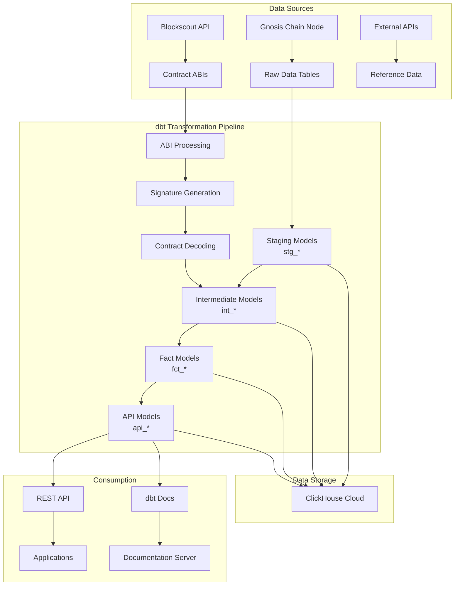
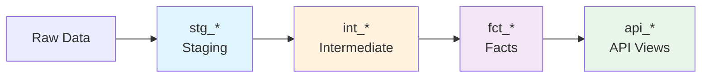
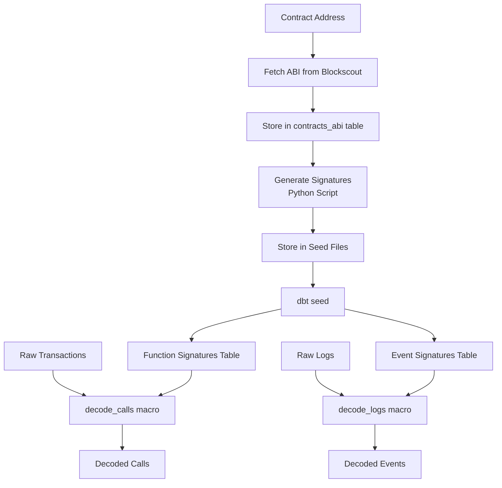

# Cerebro dbt - Gnosis Chain Analytics


A comprehensive [dbt](https://www.getdbt.com/) project for transforming and analyzing Gnosis Chain blockchain data. This project converts raw on-chain data into actionable insights across P2P networking, consensus mechanisms, execution layer activity, and environmental sustainability metrics.

## Table of Contents

- [Overview](#-overview)
- [Architecture](#-architecture)
- [Quick Start](#-quick-start)
- [Environment Setup](#-environment-setup)
- [Docker Deployment](#-docker-deployment)
- [Data Modeling Conventions](#-data-modeling-conventions)
- [Contract Decoding System](#-contract-decoding-system)
- [Development Workflow](#-development-workflow)
- [Project Structure](#-project-structure)
- [Troubleshooting](#-troubleshooting)

## 🗺️ Overview

Cerebro dbt transforms Gnosis Chain data across four main domains:

- **🔡 P2P Network**: Peer-to-peer interactions, client distributions, and network topology
- **⚖️ Consensus Layer**: Validator activity, block proposals, attestations, and consensus events
- **⚡ Execution Layer**: Transaction analysis, smart contract interactions, DeFi protocols
- **🌍 ESG & Sustainability**: Environmental metrics including power consumption and carbon emissions

All data is unified in **ClickHouse Cloud** for high-performance analytics.

## 🏗️ Architecture



## Quick Start

### Prerequisites

- Docker and Docker Compose
- ClickHouse Cloud account
- Python 3.8+ (for local development)
- Git

### Basic Setup

```bash
# 1. Clone the repository
git clone <repository-url>
cd cerebro-dbt

# 2. Create environment file
cp .env.example .env
# Edit .env with your ClickHouse credentials

# 3. Start the Docker container
docker-compose up -d

# 4. Enter the container
docker exec -it dbt /bin/bash

# 5. Test connection
dbt debug

# 6. Run all models
dbt run

# 7. Access documentation at http://localhost:8080
```

## Environment Setup

### Configuration File (.env)

Create a `.env` file in the project root with the following variables:

```bash
# ClickHouse Cloud Configuration
CLICKHOUSE_URL=your-clickhouse-cloud-host.com
CLICKHOUSE_PORT=8443
CLICKHOUSE_USER=default
CLICKHOUSE_PASSWORD=your-secure-password
CLICKHOUSE_SECURE=True
CLICKHOUSE_DATABASE=dbt_database

# Docker Configuration (optional)
USER_ID=1000
GROUP_ID=1000
```

### ClickHouse Requirements

- ClickHouse version 24.1 or later
- Database with appropriate permissions for:
  - Creating/dropping tables
  - Reading from source schemas
  - Writing to target schemas

## Docker Deployment

### Container Services

The `docker-compose.yml` provides:

- **dbt Documentation Server**: Serves interactive documentation on port 8080
- **Isolated Python Environment**: All dependencies pre-installed
- **Volume Mounting**: Real-time code updates without rebuilding
- **Environment Management**: Automatic loading of `.env` variables

### Docker Commands

```bash
# Start services
docker-compose up -d

# View logs
docker-compose logs -f dbt

# Enter container for development
docker exec -it dbt /bin/bash

# Stop services
docker-compose down

# Rebuild container (after Dockerfile changes)
docker-compose build --no-cache

# Run dbt commands from outside container
docker exec dbt dbt run
docker exec dbt dbt test
docker exec dbt dbt docs generate
```

### Production Deployment

For production environments:

```bash
# Use the production cron script
docker exec dbt /app/cron.sh

# Or set up automated runs
docker exec dbt bash -c "dbt run && dbt test"
```

## Data Modeling Conventions

### Model Layers

The project follows a strict layered architecture with naming conventions:



#### 1. Staging Models (`stg_*`)

- **Purpose**: Light transformations of raw source data
- **Location**: `models/*/staging/`
- **Characteristics**:
  - Minimal transformations (type casting, column renaming)
  - 1:1 relationship with source tables
  - Usually materialized as views
  - No business logic

**Example**:
```sql
-- stg_execution__blocks.sql
SELECT 
    block_number,
    CONCAT('0x', author) AS author,  -- Format standardization
    block_timestamp
FROM {{ source('execution','blocks') }}
```

#### 2. Intermediate Models (`int_*`)

- **Purpose**: Heavy transformations and business logic
- **Location**: `models/*/intermediate/`
- **Characteristics**:
  - Complex joins and aggregations
  - Materialized as incremental tables for performance
  - Contains business logic and calculations
  - Often partitioned by month

**Example**:
```sql
-- int_execution_blocks_clients_version_daily.sql
{{ 
    config(
        materialized='incremental',
        incremental_strategy='delete+insert',
        partition_by='toStartOfMonth(date)'
    ) 
}}
```

#### 3. Fact Models (`fct_*`)

- **Purpose**: Business-ready metrics and KPIs
- **Location**: `models/*/marts/`
- **Characteristics**:
  - Final business transformations
  - Usually materialized as views
  - Optimized for querying
  - Contains calculated metrics

#### 4. API Models (`api_*`)

- **Purpose**: Models served via REST API
- **Location**: `models/*/marts/`
- **Characteristics**:
  - Simplified structure for API consumption
  - Always materialized as views
  - Optimized for read performance
  - Consistent naming and structure

### Incremental Processing Strategy

```sql
{{ 
    config(
        materialized='incremental',
        incremental_strategy='delete+insert',
        engine='ReplacingMergeTree()',
        order_by='(block_timestamp, transaction_hash)',
        unique_key='(block_timestamp, transaction_hash)',
        partition_by='toStartOfMonth(block_timestamp)'
    )
}}

-- Use the monthly filter macro
{{ apply_monthly_incremental_filter('block_timestamp', 'date') }}
```

## Contract Decoding System

### Overview

The contract decoding system transforms raw blockchain data into human-readable formats:



### Complete Workflow for Adding New Contracts

#### Step 1: Fetch Contract ABI

```bash
# Enter the container
docker exec -it dbt /bin/bash

# Fetch ABI for a single contract
dbt run-operation fetch_and_insert_abi --args '{"address": "0xe91d153e0b41518a2ce8dd3d7944fa863463a97d"}'

# For multiple contracts, repeat the command
dbt run-operation fetch_and_insert_abi --args '{"address": "0xAnotherAddress"}'
```

#### Step 2: Export ABIs and Generate Signatures

```bash
# IMPORTANT: Export current ABIs to prevent data loss
# This creates/updates the contracts_abi.csv seed file
python scripts/abi/export_contracts_abi.py

# Generate signature files from ABIs
python scripts/signatures/signature_generator.py

# This creates/updates:
# - seeds/event_signatures.csv
# - seeds/function_signatures.csv
```

#### Step 3: Load Seeds into Database

```bash
# Load all seed files into ClickHouse
dbt seed

# Or load specific seeds
dbt seed --select contracts_abi
dbt seed --select event_signatures
dbt seed --select function_signatures
```

#### Step 4: Create Decoding Models

Create models for your contract:

```sql
-- models/execution/contracts/your_protocol/your_contract_events.sql
{{ 
    config(
        materialized='incremental',
        incremental_strategy='delete+insert',
        engine='ReplacingMergeTree()',
        order_by='(block_timestamp, log_index)',
        partition_by='toStartOfMonth(block_timestamp)',
        pre_hook=["SET allow_experimental_json_type = 1"]
    )
}}

{{ 
    decode_logs(
        source_table=source('execution','logs'),
        contract_address='0xYourContractAddress',
        output_json_type=true,
        incremental_column='block_timestamp'
    )
}}
```

#### Step 5: Run Your Models

```bash
# Run specific contract models
dbt run --select your_contract_events your_contract_calls

# Or run all contract models
dbt run --select execution.contracts
```

### Important Notes on ABI Management

⚠️ **Critical**: Always export ABIs before running `dbt seed` to prevent data loss:

```bash
# Correct workflow when adding new contracts:
1. dbt run-operation fetch_and_insert_abi --args '{"address": "0x..."}'
2. python scripts/abi/export_contracts_abi.py  # Export to CSV
3. python scripts/signatures/signature_generator.py
4. dbt seed  # Now safe to run
```

The `contracts_abi` table in ClickHouse is the source of truth, but `dbt seed` will overwrite it with the CSV contents. Always export first!

## Development Workflow

### Creating New Models

1. **Choose the appropriate layer**:
   - Raw data transformation → `stg_*`
   - Complex business logic → `int_*`
   - Business metrics → `fct_*`
   - API endpoints → `api_*`

2. **Follow naming conventions**:
   ```
   stg_{source}__{table}
   int_{domain}_{metric}_{grain}
   fct_{domain}_{metric}_{grain}
   api_{domain}_{metric}_{grain}
   ```

3. **Configure materialization**:
   ```sql
   -- Staging: usually view
   {{ config(materialized='view') }}
   
   -- Intermediate: incremental for large datasets
   {{ config(
       materialized='incremental',
       incremental_strategy='delete+insert'
   ) }}
   
   -- Facts/API: view for real-time data
   {{ config(materialized='view') }}
   ```

### Testing Models

```bash
# Run all tests
dbt test

# Test specific model
dbt test --select my_model

# Run and test together
dbt build --select +my_model
```

### Documentation

```bash
# Generate documentation
dbt docs generate

# Serve locally (inside container)
dbt docs serve --port 8000 --host 0.0.0.0

# Documentation is automatically served on port 8080 via Docker
```

## Project Structure

```
cerebro-dbt/
├── models/
│   ├── consensus/          # Consensus layer models
│   │   ├── staging/       # stg_consensus__*
│   │   ├── intermediate/  # int_consensus_*
│   │   └── marts/        # fct_consensus_*, api_consensus_*
│   ├── execution/         # Execution layer models
│   │   ├── staging/
│   │   ├── intermediate/
│   │   └── marts/
│   ├── contracts/         # Decoded contract data
│   │   └── {protocol}/    # One folder per protocol
│   ├── p2p/              # P2P network models
│   └── ESG/              # Environmental metrics
├── macros/
│   ├── db/               # Database utilities
│   ├── decoding/         # Contract decoding macros
│   └── execution/        # Execution helpers
├── seeds/                # Static reference data
│   ├── contracts_abi.csv
│   ├── event_signatures.csv
│   └── function_signatures.csv
├── scripts/
│   ├── abi/             # ABI export utilities
│   │   └── export_contracts_abi.py
│   └── signatures/       # Signature generation
│       └── signature_generator.py
└── tests/               # Data quality tests
```

## Troubleshooting

### Common Issues and Solutions

#### 1. Missing ABI After Seed

**Problem**: Running `dbt seed` overwrites newly fetched ABIs

**Solution**:
```bash
# Always export before seeding
python scripts/abi/export_contracts_abi.py
python scripts/signatures/signature_generator.py
dbt seed
```

#### 2. Signature Generation Fails

**Problem**: Python script fails to generate signatures

**Solution**:
```bash
# Check Python dependencies
pip install -r requirements.txt

# Verify ABI data exists
SELECT COUNT(*) FROM contracts_abi;

# Check for malformed JSON
SELECT contract_address 
FROM contracts_abi 
WHERE NOT isValidJSON(abi_json);
```

#### 3. Incremental Model Not Updating

**Problem**: Incremental models not processing new data

**Solution**:
```bash
# Force full refresh
dbt run --select my_model --full-refresh

# Check incremental filter
SELECT MAX(block_timestamp) FROM my_model;
```

#### 4. Docker Container Issues

**Problem**: Container won't start or connect to ClickHouse

**Solution**:
```bash
# Check logs
docker-compose logs dbt

# Verify environment variables
docker exec dbt env | grep CLICKHOUSE

# Test connection
docker exec dbt dbt debug
```

#### 5. Contract Decoding Returns Empty Results

**Problem**: Decoded tables are empty despite having signatures

**Checklist**:
- Contract address matches exactly (case-sensitive)
- Signatures were generated and seeded
- Raw data exists for the time period
- Check start_blocktime parameter in model

```sql
-- Debug query
SELECT COUNT(*) 
FROM execution.logs 
WHERE address = '0xYourAddress'
  AND block_timestamp > '2024-01-01';
```


## License

This project is licensed under the [MIT License](LICENSE).
