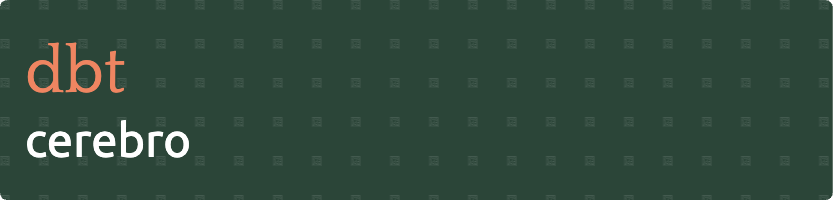

This repository contains [dbt](https://www.getdbt.com/) models used for analyzing blockchain data on the **Gnosis Chain**. These models transform raw on-chain and scraped data into actionable insights.

## Overview

This dbt project enables the transformation and analysis of Gnosis Chain data across multiple domains:

- **P2P Network**: Analyzes peer-to-peer interactions and decentralized finance protocol activity.
- **Consensus**: Monitors validator activity, block proposals, attestations, and related consensus-layer events.
- **Execution**: Tracks wallet behaviors, smart contract interactions, and user activity on the execution layer.
- **Scraped Data**: Enriches on-chain data with additional information from scraping tools and external sources.

All data sources are unified in **ClickHouse Cloud**, simplifying integration and analysis across domains.

## Project Structure

- `models/`: SQL-based dbt models for transforming and organizing raw blockchain data.
- `macros/`: Custom Jinja macros for reusable logic across models.
- `seeds/`: Static CSV files used as reference or lookup tables in the transformation process.

## Usage

To run dbt inside the container:

```bash
docker exec -it dbt /bin/bash
```

Inside your models, use the standardized flexible source macro to access ClickHouse Cloud tables:

```sql
{{ flexible_source('execution', 'transactions') }}
```

Supported source domains: `execution`, `consensus`, `nebula`, `crawlers_data`.

## Contributing

Contributions are welcome! Please open issues or pull requests for bugs, feature suggestions, or improvements to the data models.

## License

This project is licensed under the [MIT License](LICENSE).
