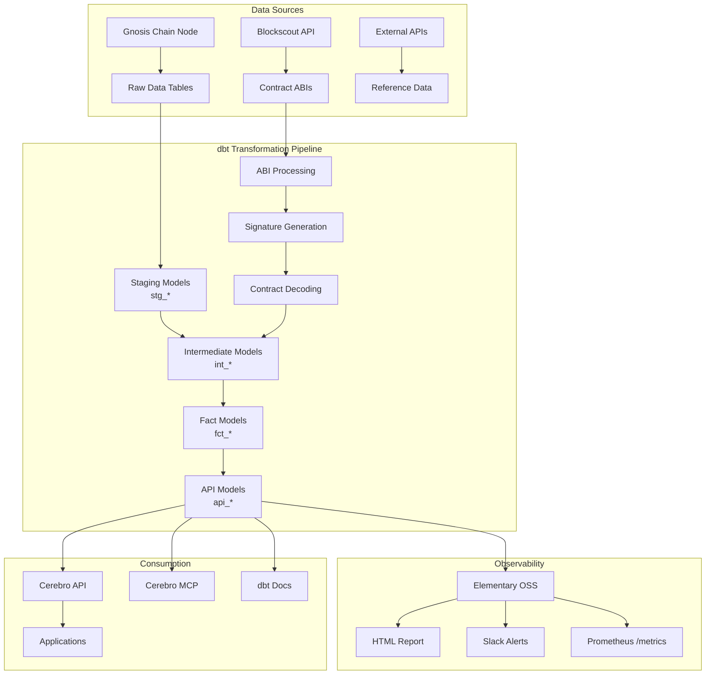
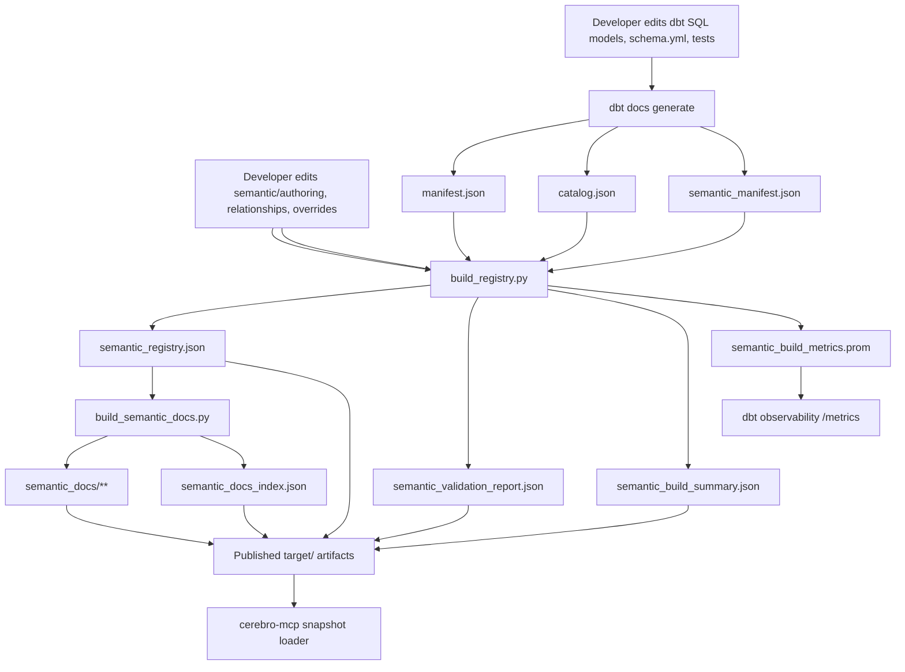
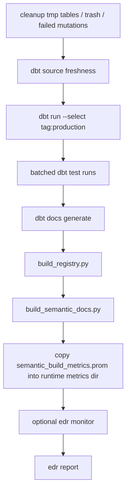
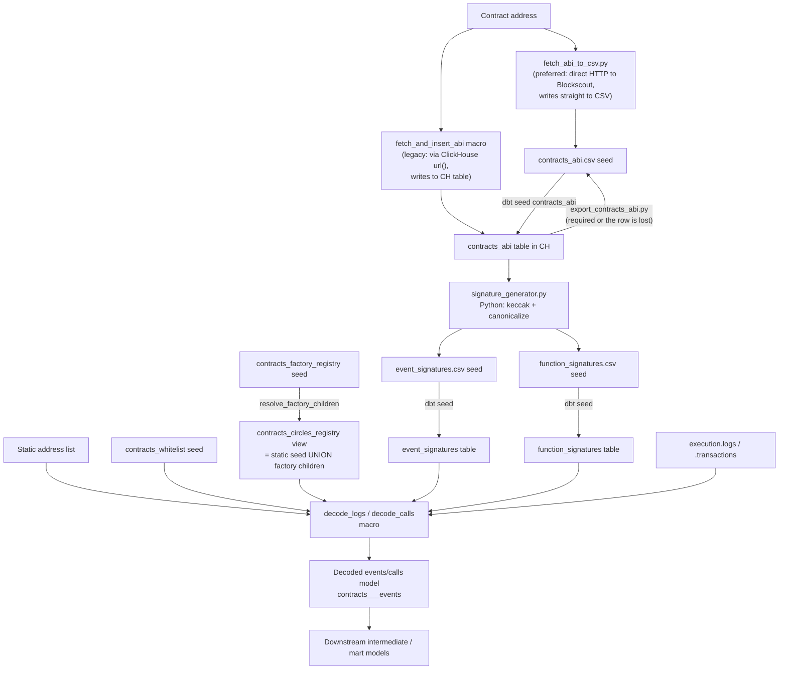
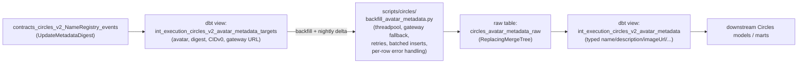

# Cerebro dbt - Gnosis Chain Analytics


A comprehensive [dbt](https://www.getdbt.com/) project for transforming and analyzing Gnosis Chain blockchain data. This project converts raw on-chain data into actionable insights across P2P networking, consensus mechanisms, execution layer activity, and environmental sustainability metrics.

## Table of Contents

- [Overview](#overview)
- [Architecture](#architecture)
- [Quick Start](#quick-start)
- [Environment Setup](#environment-setup)
- [Local Development](#local-development)
- [Semantic Layer Workflow](#semantic-layer-workflow)
- [Docker Deployment](#docker-deployment)
- [Data Modeling Conventions](#data-modeling-conventions)
- [Observability and Testing](#observability-and-testing)
- [Contract Decoding System](#contract-decoding-system)
- [Circles V2 Avatar IPFS Metadata](#circles-v2-avatar-ipfs-metadata)
- [Production Pipeline](#production-pipeline)
- [Project Structure](#project-structure)
- [Troubleshooting](#troubleshooting)

## Overview

Cerebro dbt transforms Gnosis Chain data across eight modules:

| Module | Description | Models |
|--------|-------------|--------|
| **execution** | Transaction analysis, token tracking, gas metrics, DeFi protocols, GPay wallet analytics, **Safe wallet catalog, Gnosis Pay on-chain modules, Gnosis App heuristic sector** | ~225 |
| **consensus** | Validator activity, block proposals, attestations, deposits/withdrawals, APY distributions | ~54 |
| **contracts** | Decoded smart contract events and calls (BalancerV2/V3, UniswapV3, Aave, Swapr, etc.) | ~44 |
| **p2p** | Peer-to-peer network topology, client distributions, crawl analytics (Discv4/Discv5) | ~27 |
| **bridges** | Cross-chain bridge flows, token net flows, Sankey visualizations | ~18 |
| **ESG** | Power consumption, carbon emissions, node classification, sustainability metrics | ~18 |
| **crawlers_data** | External datasets: Dune labels, prices, GNO supply | ~9 |
| **probelab** | ProbeLab network measurements: client versions, cloud distribution, QUIC support | ~9 |

All data is stored in **ClickHouse Cloud** and served via [Cerebro API](https://api.analytics.gnosis.io) and [Cerebro MCP](https://mcp.analytics.gnosis.io).

## Architecture


```mermaid
graph TD
    subgraph "Data Sources"
        A[Gnosis Chain Node] --> B[Raw Data Tables]
        C[Blockscout API] --> D[Contract ABIs]
        E[External APIs] --> F[Reference Data]
    end

    subgraph "dbt Transformation Pipeline"
        B --> G[Staging Models<br/>stg_*]
        G --> H[Intermediate Models<br/>int_*]
        H --> I[Fact Models<br/>fct_*]
        I --> J[API Models<br/>api_*]

        D --> K[ABI Processing]
        K --> L[Signature Generation]
        L --> M[Contract Decoding]
        M --> H
    end

    subgraph "Observability"
        J --> OBS[Elementary OSS]
        OBS --> REPORT[HTML Report]
        OBS --> SLACK[Slack Alerts]
        OBS --> METRICS[Prometheus /metrics]
    end

    subgraph "Consumption"
        J --> O[Cerebro API]
        J --> MCP[Cerebro MCP]
        J --> P[dbt Docs]
        O --> Q[Applications]
    end
```

## Quick Start

### Prerequisites

- Docker and Docker Compose
- ClickHouse Cloud account (or local ClickHouse instance)
- Python 3.10+ (for local development outside Docker)
- Git

### Basic Setup

```bash
# 1. Clone the repository
git clone https://github.com/gnosischain/dbt-cerebro.git
cd dbt-cerebro

# 2. Create environment file
cp .env.example .env
# Edit .env with your ClickHouse credentials

# 3. Build and start the Docker container
docker-compose up -d --build

# 4. Enter the container
docker exec -it dbt /bin/bash

# 5. Install dbt packages
dbt deps

# 6. Test connection
dbt debug

# 7. Run all production models
dbt run --select tag:production

# 8. Run tests
dbt test --select tag:production
```

## Environment Setup

### Configuration File (.env)

Create a `.env` file in the project root:

```bash
# ClickHouse Cloud Configuration
CLICKHOUSE_URL=your-clickhouse-cloud-host.com
CLICKHOUSE_PORT=8443
CLICKHOUSE_USER=default
CLICKHOUSE_PASSWORD=your-secure-password
CLICKHOUSE_SECURE=True
CLICKHOUSE_DATABASE=dbt

# Optional: Slack webhook for Elementary alerts
SLACK_WEBHOOK=https://hooks.slack.com/services/...

# Optional: Docker user mapping
USER_ID=1000
GROUP_ID=1000
```

For local Docker, set `USER_ID` and `GROUP_ID` to your host values from `id -u` and `id -g` before rebuilding the image.

### ClickHouse Requirements

- ClickHouse version 24.1 or later
- Schemas: `execution`, `consensus`, `nebula`, `nebula_discv4`, `crawlers_data`, `dbt`, `elementary`
- Appropriate read/write permissions across schemas

## Local Development

### Running Inside Docker (recommended)

Docker gives you the full environment with all dependencies pre-installed:

```bash
# Match the container user to your host user before rebuilding
export USER_ID=$(id -u)
export GROUP_ID=$(id -g)

# Build and start
docker-compose up -d --build

# Enter the container
docker exec -it dbt /bin/bash

# Inside the container — all dbt and edr commands are available:
dbt deps
dbt compile
dbt run --select tag:production
dbt test --select tag:production
dbt source freshness
edr report --file-path /app/reports/elementary_report.html --target-path /app/edr_target
```

The docker-compose setup bind-mounts the repo into `/app`, so code changes are reflected immediately without rebuilding.
Matching `USER_ID` and `GROUP_ID` avoids bind-mounted file ownership issues for local Docker runs.

### Running Locally (without Docker)

```bash
# Create a virtual environment
python -m venv .venv
source .venv/bin/activate

# Install runtime dependencies
pip install -r requirements.txt

# Install dev dependencies (for migration scripts)
pip install -r requirements-dev.txt

# Set up profiles
mkdir -p ~/.dbt
ln -sf $(pwd)/profiles.yml ~/.dbt/profiles.yml

# Load environment variables
export $(cat .env | grep -v '^#' | xargs)

# Run dbt
dbt deps
dbt debug
dbt run --select tag:production
```

### Testing the Observability Server

The Dockerfile now includes a lightweight observability server that replaces the old `python -m http.server`. In production (Kubernetes), it serves `/health`, `/metrics`, and static report/log files.

To test it locally:

```bash
# Build the image
docker build -t dbt-cerebro:local .

# Run the observability server
docker run -p 8000:8000 dbt-cerebro:local

# In another terminal:
curl http://localhost:8000/health    # → {"status": "ok"}
curl http://localhost:8000/metrics   # → Prometheus text format
curl http://localhost:8000/           # → Service info JSON
```

### Testing the Full Pipeline Locally

```bash
docker exec -it dbt /bin/bash

# 1. Compile to verify all YAML is valid
dbt compile

# 2. Run source freshness checks
dbt source freshness

# 3. Run models
dbt run --select tag:production

# 4. Run all tests (including Elementary)
dbt test --select tag:production

# 5. Generate the Elementary report
edr report \
  --profiles-dir /home/appuser/.dbt \
  --project-dir /app \
  --file-path /app/reports/elementary_report.html \
  --target-path /app/edr_target

# 6. Open the report (from host, not container)
open reports/elementary_report.html  # macOS
# or: xdg-open reports/elementary_report.html  # Linux
```

### Running the Cron Orchestrator Locally

The production pipeline uses a shared orchestrator script. To test it locally:

```bash
docker exec -it dbt /bin/bash

# Preview mode (minimal mandatory steps, reduced test scope)
/app/cron_preview.sh

# Production mode (all steps mandatory)
/app/cron.sh

# Or run the orchestrator directly with custom env
EDR_REPORT_ENV=dev DBT_TEST_SCOPE=preview_subset /app/scripts/run_dbt_observability.sh
```

Cron/orchestrator runs force dbt logs into `${RUNTIME_DATA_DIR:-/data}/logs` so they do not depend on bind-mounted `./logs`.
If you previously ran Docker with a mismatched UID/GID and hit `PermissionError` on `logs/dbt.log*`, remove those files or repair ownership once on the host before retrying.

The orchestrator runs these steps in order:
1. `dbt source freshness` — check source data staleness
2. `dbt run --select tag:production` — run all production models
3. batched `dbt test` runs — execute model and Elementary tests without exhausting ClickHouse temp tables
4. `dbt docs generate` — refresh manifest, catalog, and semantic manifest artifacts
5. `python scripts/semantic/build_registry.py --target-dir target` — build semantic registry, validation report, summary, and Prometheus text metrics
6. `python scripts/semantic/build_semantic_docs.py --target-dir target` — build semantic docs pages and docs index
7. `edr monitor` — send Slack alerts (only when `SLACK_WEBHOOK` is set)
8. `edr report` — generate the HTML observability report

Each step's exit code is captured independently. The script never exits early — it always completes all steps, then prints a summary and exits non-zero if any mandatory step failed.

`DBT_TEST_SCOPE` controls which dbt test batches are run:
- `full` (default) keeps the current full batch list used by production.
- `preview_subset` runs only source tests, crawler-data tests, contract tests, and `api_*` marts tests discovered at runtime.

This scopes preview runs at runtime only. Existing schema, source, and Elementary test definitions stay in the repo unchanged.

## Semantic Layer Workflow

The semantic layer in `dbt-cerebro` is not a second dbt project. It is a repository-local authoring and compilation system that sits next to normal dbt modeling.

### Naming and scope

The docs use three names that should not be mixed together:

- `dbt`: the upstream build toolchain, especially dbt Core, dbt docs artifacts, and MetricFlow validation
- `dbt-cerebro`: this repository, including its custom semantic authoring, compiler scripts, docs builder, and cron/orchestrator
- `cerebro-mcp`: the downstream runtime that later loads the published semantic artifacts

When this README says `Cerebro`, it means the broader product family. When it describes behavior in this repo, it should say `dbt-cerebro`.

The short version:

- dbt remains the source of truth for SQL models, sources, columns, tests, lineage, and generated artifacts such as `manifest.json` and `catalog.json`
- `dbt-cerebro` adds a richer semantic layer on top of those dbt artifacts using custom authoring in `semantic/authoring/**`
- the `dbt-cerebro` semantic compiler merges dbt artifacts plus semantic authoring into a stable registry, validation report, docs index, docs pages, and Prometheus build metrics
- the cron/orchestrator builds both layers together in the runtime environment, and CI publishes the static artifact set
- `cerebro-mcp` later consumes the published semantic artifacts at runtime

### Why the semantic flow is split from dbt

We originally tried placing the broad semantic surface directly under `models/**/semantic_models.yml`, but dbt `1.9.x` and MetricFlow validate every semantic model they see. That is good for a small approved MetricFlow surface, but it is too strict for the broader semantic authoring needs inside `dbt-cerebro`:

- candidate semantic models for every reviewable public model
- richer relationship metadata than dbt currently supports
- docs-only coverage for models that are not yet execution-safe
- broader naming and authoring iteration before something is approved

Because of that, the project now uses this rule:

- active semantic authoring lives in `semantic/authoring/**/semantic_models.yml`
- `semantic/relationships/*.yml` and `semantic/overrides/*.yml` hold `dbt-cerebro`-specific graph behavior and overrides
- `models/**/semantic_models.yml` is reserved for a future dbt-native-approved subset only after a model has been intentionally remodeled into a MetricFlow-valid shape
- today, there are no active semantic model files under `models/**`

This keeps `dbt docs generate` stable while still letting `dbt-cerebro` maintain full semantic coverage.

### New concepts

These are the key concepts behind the new flow.

- `semantic authoring`: the human-maintained semantic definitions in `semantic/authoring/**`
- `candidate`: scaffolded or partially reviewed semantics that exist for coverage and docs, but are not yet approved for public execution
- `approved`: a semantic model, metric, or relationship that has been explicitly reviewed and is allowed to drive runtime semantic execution
- `docs_only`: a model or source that still appears in the registry and docs, even if it has no executable semantics
- `relationship authoring`: curated join rules in `semantic/relationships/*.yml`; these are not inferred as approved from lineage alone
- `override authoring`: aliases, preferences, deprecations, and docs enrichment in `semantic/overrides/*.yml`
- `semantic registry`: the compiled artifact that combines dbt metadata and semantic authoring into one runtime-friendly document
- `semantic docs`: generated pages and a search index built from the registry
- `time spine`: the shared MetricFlow-compatible date spine that allows dbt semantic parsing and gives the `dbt-cerebro` semantic layer a standard daily backbone for cumulative and gap-filled logic

### What lives where

| Surface | Purpose | Owned by | Used by |
|-------|--------|---------|--------|
| `models/**` | SQL models, dbt docs/tests/lineage, time spine registration | `dbt-cerebro` dbt project | dbt and `dbt-cerebro` compiler |
| `semantic/authoring/**` | semantic models and metrics under review | `dbt-cerebro` semantic layer | registry/docs compiler |
| `semantic/relationships/*.yml` | curated graph edges and join safety rules | `dbt-cerebro` semantic layer | planner/runtime |
| `semantic/overrides/*.yml` | aliases, deprecations, docs enrichment, preferences | `dbt-cerebro` semantic layer | compiler/runtime/docs |
| `target/manifest.json`, `target/catalog.json`, `target/semantic_manifest.json` | dbt-generated metadata | dbt | registry compiler |
| `target/semantic_registry.json`, `target/semantic_docs/**` | runtime semantic artifacts | `dbt-cerebro` semantic compiler | `cerebro-mcp` |

### End-to-end flow


```mermaid
flowchart TD
    A["Developer edits dbt SQL models, schema.yml, tests"] --> B["dbt docs generate"]
    C["Developer edits semantic/authoring, relationships, overrides"] --> D["build_registry.py"]
    B --> E["manifest.json"]
    B --> F["catalog.json"]
    B --> G["semantic_manifest.json"]
    E --> D
    F --> D
    G --> D
    C --> D
    D --> H["semantic_registry.json"]
    D --> I["semantic_validation_report.json"]
    D --> J["semantic_build_summary.json"]
    D --> K["semantic_build_metrics.prom"]
    H --> L["build_semantic_docs.py"]
    L --> M["semantic_docs/**"]
    L --> N["semantic_docs_index.json"]
    M --> O["Published target/ artifacts"]
    N --> O
    H --> O
    I --> O
    J --> O
    K --> P["dbt observability /metrics"]
    O --> Q["cerebro-mcp snapshot loader"]
```

### dbt metadata flow and the dbt-cerebro semantic flow are running in parallel

The easiest mental model is:

- dbt builds the warehouse and emits metadata
- `dbt-cerebro` reads that metadata and adds a semantic layer on top

dbt is not aware of most `dbt-cerebro` semantic authoring. The semantic compiler is intentionally downstream of dbt.

That means:

- adding a new dbt model does not automatically make it an approved semantic model
- semantic coverage can advance without changing the SQL model itself
- semantic docs and semantic registry builds depend on `dbt docs generate`, but not the other way around
- failures in broad candidate semantics should not break `dbt docs generate`

### Manual intervention points

The semantic flow is not fully automatic on purpose. These are the places where people intervene.

1. Add or change a dbt model.
2. Regenerate dbt artifacts with `dbt docs generate`.
3. Scaffold missing candidate semantics with `scaffold_candidates.py`.
4. Review the scaffolded semantics and clean up vague names such as `value`, `label`, or raw field names that are not meaningful to users.
5. Decide whether the model stays `candidate`, becomes `approved`, or remains effectively docs-only.
6. Add curated relationships if the model must participate in cross-model semantic routing.
7. Rebuild and validate the registry before merge.

Things that are automatic:

- registry coverage for every first-party model and source
- docs page generation for compiled semantic artifacts
- Prometheus text metrics generation for semantic builds
- publication of semantic artifacts during the CI release flow

Things that are intentionally manual:

- approving a model for execution
- approving a metric for user-facing use
- approving a relationship for graph routing
- deciding if a model should ever become dbt-native-valid semantic YAML under `models/**`

### Local build flow

Use this sequence when working on semantics locally:

```bash
dbt docs generate
python scripts/semantic/scaffold_candidates.py --target-dir target
python scripts/semantic/scaffold_candidates.py --target-dir target --write
python scripts/semantic/report_candidates.py --target-dir target
python scripts/semantic/build_registry.py --validate --target-dir target
python scripts/semantic/build_semantic_docs.py --target-dir target
```

Generated semantic artifacts:

- `target/semantic_registry.json`
- `target/semantic_validation_report.json`
- `target/semantic_docs_index.json`
- `target/semantic_docs/`
- `target/semantic_build_summary.json`
- `target/semantic_build_metrics.prom`

Semantic parsing also depends on the shared MetricFlow time spine model in [schema.yml](/Users/hugser/Documents/Gnosis/repos/dbt-cerebro/models/shared/marts/schema.yml). Keep `dim_time_spine_daily` registered with `time_spine.standard_granularity_column: day` and `granularity: day` on the `day` column.

### Adding a future model

For every new analytical model:

1. Add the normal dbt SQL, docs, tests, and metadata.
2. Run `dbt docs generate`.
3. Run the scaffold generator and write the missing candidate into `semantic/authoring/`.
4. Review whether that model is a public semantic surface, an internal bridge, or docs-only coverage.
5. If it is public, add clear entities, dimensions, measures, and curated relationships.
6. Promote to `approved` only after explicit review.
7. Rebuild the registry, validation report, and semantic docs before merge.

### No-duplicates rule

The project now follows a strict no-duplicates rule:

- do not define the same semantic model in both `semantic/authoring/**` and `models/**`
- by default, keep semantic authoring only in `semantic/authoring/**`
- only move a definition into `models/**/semantic_models.yml` if it has been intentionally rewritten to satisfy dbt-native MetricFlow constraints
- when that future move happens, remove the duplicate from `semantic/authoring/**`

### What the cron/orchestrator actually does

Production does not just run dbt and stop. The orchestrator builds the semantic layer as part of the same operational run.

The script is [run_dbt_observability.sh](/Users/hugser/Documents/Gnosis/repos/dbt-cerebro/scripts/run_dbt_observability.sh), and the semantic portion of the flow is:


```mermaid
flowchart TD
    A["cleanup tmp tables / trash / failed mutations"] --> B["dbt source freshness"]
    B --> C["dbt run --select tag:production"]
    C --> D["batched dbt test runs"]
    D --> E["dbt docs generate"]
    E --> F["build_registry.py"]
    F --> G["build_semantic_docs.py"]
    G --> H["copy semantic_build_metrics.prom into runtime metrics dir"]
    H --> I["optional edr monitor"]
    I --> J["edr report"]
```

### What is automatic in cron vs what is not

Automatic in cron:

- regenerate dbt metadata artifacts
- rebuild semantic registry and docs artifacts
- emit semantic build metrics
- expose those metrics through the dbt observability server

Automatic in CI/release:

- run `dbt docs generate`
- rebuild semantic registry and semantic docs in a clean GitHub Actions environment
- publish the built `target/` directory to `gh-pages`

Not automatic in cron:

- semantic approvals
- relationship curation
- semantic naming cleanup
- promotion from candidate to approved

Cron builds whatever is already in the repo inside the deployed runtime. CI is what republishes the static artifact set externally. Neither path makes judgment calls.

### What gets published

After a successful CI docs deployment, the semantic system expects these published artifacts:

- `manifest.json`
- `catalog.json`
- `semantic_manifest.json`
- `semantic_registry.json`
- `semantic_validation_report.json`
- `semantic_docs_index.json`
- `semantic_build_summary.json`
- `semantic_build_metrics.prom`
- `semantic_docs/**`

`cerebro-mcp` later downloads those artifacts and builds its runtime semantic snapshot from them.

### Runtime semantic observability

The semantic build writes Prometheus text metrics into `target/semantic_build_metrics.prom`. The orchestrator copies that file into the runtime metrics directory, and the dbt observability server appends `.prom` files from runtime storage into `/metrics`.

That means the dbt service exposes:

- standard dbt observability information
- semantic build success/failure
- semantic build duration
- semantic coverage counts
- semantic validation warning/error counts

## Docker Deployment

### Container Services

The `docker-compose.yml` provides:

- **dbt Documentation Server**: Serves interactive documentation on port 8080
- **Isolated Python Environment**: All dependencies pre-installed
- **Volume Mounting**: Real-time code updates without rebuilding
- **Environment Management**: Automatic loading of `.env` variables

### Docker Commands

```bash
# Start services
docker-compose up -d

# View logs
docker-compose logs -f dbt

# Enter container for development
docker exec -it dbt /bin/bash

# Stop services
docker-compose down

# Rebuild container (after Dockerfile changes)
docker-compose build --no-cache

# Run dbt commands from outside container
docker exec dbt dbt run --select tag:production
docker exec dbt dbt test --select tag:production
docker exec dbt dbt source freshness
```

### Kubernetes Deployment

The preview and production deployments use Terraform in the [infrastructure repo](https://github.com/gnosischain/infrastructure-gnosis-analytics-deployments). Key differences from docker-compose:

- **Deployment pod**: Runs `app/observability_server.py` (health/metrics + static file serving)
- **CronJob**: Runs `cron_preview.sh` or `cron.sh` on a daily schedule (6 AM UTC)
- **dbt deps**: Baked into the image at build time (not run at container start)
- **Root filesystem**: Read-only in Kubernetes; writable paths via emptyDir volumes at `/data` and `/tmp`
- **Monitoring**: PodMonitor scrapes `/metrics` from the Deployment pod; CronJob uses kube-state-metrics

## Data Modeling Conventions

### Model Layers

| Layer | Prefix | Purpose | Materialization |
|-------|--------|---------|-----------------|
| Staging | `stg_` | Light transformations of raw source data | View |
| Intermediate | `int_` | Complex joins, aggregations, business logic | Incremental |
| Fact | `fct_` | Business-ready metrics and KPIs | View or incremental |
| API | `api_` | Models served via Cerebro API / MCP | View |

### Model Metadata Contract

Every model in `schema.yml` carries these meta fields:

```yaml
meta:
  owner: analytics_team           # Always analytics_team
  authoritative: false            # true for source-of-truth models
  full_refresh:                   # Optional — consumed by scripts/full_refresh/refresh.py
    start_date: "2021-01-01"
    batch_months: 6
    stages: [...]                 # Optional multi-stage batching
  inference_notes: "..."          # Optional documentation
```

Allowed meta keys: `owner`, `authoritative`, `full_refresh`, `inference_notes`. No other keys should be added to model meta.

### Source Metadata

Source files (`*_sources.yml`) carry freshness configuration:

```yaml
sources:
  - name: execution
    loaded_at_field: block_timestamp
    freshness:
      warn_after: {count: 26, period: hour}
      error_after: {count: 48, period: hour}
    meta:
      owner: analytics_team
      authoritative: true
```

| Source | Freshness SLA | Notes |
|--------|--------------|-------|
| `execution` | warn 26h / error 48h | Daily pipeline cadence |
| `consensus` | warn 26h / error 48h | Daily pipeline cadence |
| `p2p` (nebula) | warn 36h / error 72h | Crawl-based ingestion |
| `probelab` | warn 36h / error 72h | External rollups |
| `crawlers_data` (Dune) | Mixed table-level SLA | `dune_bridge_flows`/`dune_labels`: warn 18h / error 30h; `dune_prices`/`dune_gno_supply`: warn 36h / error 48h so a 06:00 run still errors when the latest business date falls back from yesterday to D-2 |

## Cross-Domain Identity & Privacy

Some Cerebro models join Mixpanel product analytics to on-chain data. Both sides contain identifiers that can re-identify a real person — wallet addresses on-chain, `distinct_id` (often a wallet) in Mixpanel — so cross-domain joins are implemented through a single keyed-hash pseudonym pattern that never materializes a raw address downstream.

The macro lives at [`macros/pseudonymize_address.sql`](macros/pseudonymize_address.sql):

```jinja

    sipHash64(concat(unhex('{{ env_var("CEREBRO_PII_SALT") }}'), lower({{ addr_expr }})))

```

Three rules govern its use:

1. **`CEREBRO_PII_SALT` is required.** A hex-encoded string (generate with `openssl rand -hex 32`), set in the dbt orchestrator's environment, never committed. `env_var(...)` is called without a default — `dbt parse` fails loudly if it's missing.
2. **Apply on both sides of every cross-domain join.** Mixpanel staging (`stg_mixpanel_ga__events.user_id_hash` / `device_id_hash`) and the on-chain side (e.g. `int_execution_gpay_safe_identities`) both run their inputs through the same macro, so the pseudonym is identical for the same address regardless of which side originated it. Joins are then `mp.user_id_hash = onchain.user_pseudonym`.
3. **Never write `sipHash64(...)` directly anywhere a wallet is involved.** Always use the macro. Repo-level grep guard:
   ```bash
   rg "sipHash64\(" models/ | rg -v "pseudonymize_address\|user_id_hash\|device_id_hash"
   ```

The salt is permanent. Rotating it invalidates every pseudonym already in the warehouse and breaks every cross-domain join that assumes continuity. Treat it like a database password that you cannot reset.

The first production users of this pattern are:

- [`stg_mixpanel_ga__events`](models/mixpanel_ga/staging/stg_mixpanel_ga__events.sql) — pseudonymizes `distinct_id` and `$device_id` at ingest
- [`fct_mixpanel_ga_gpay_crossdomain_daily`](models/mixpanel_ga/marts/fct_mixpanel_ga_gpay_crossdomain_daily.sql) — Gnosis Pay cardholder ↔ Mixpanel daily rollup
- *(planned)* `int_execution_gpay_safe_identities`, `fct_mixpanel_ga_gpay_users` — per-user GP bridge with union-match on initial owner / delegate / Safe self
- *(planned)* `int_execution_gnosis_app_user_identities`, `fct_mixpanel_ga_gnosis_app_users` — heuristic Gnosis App sector with Mixpanel as a *check*, not a source of truth

Deep dive: <https://docs.analytics.gnosis.io/data-pipeline/transformation/privacy-pseudonyms/>

## Observability and Testing

### Elementary OSS

[Elementary](https://www.elementary-data.com/) is the primary data observability layer. It provides anomaly detection, schema change monitoring, freshness tracking, and an interactive HTML report.

**Package version**: 0.22.1 (in `packages.yml` and `requirements.txt`)

### Test Coverage Summary

| Metric | Count |
|--------|-------|
| Total models | 354 |
| Models with Elementary tests | 281 |
| Volume anomaly tests | 132 |
| Freshness anomaly tests | 132 |
| Schema change tests | 281 |
| Column anomaly tests | 108 |
| Sources with freshness | 5 |

### Elementary Test Types by Model Class

| Model Class | Count | Elementary Tests | Notes |
|-------------|-------|-----------------|-------|
| Daily (`*_daily`) | 121 | volume + freshness + column anomalies + schema changes | Primary observability targets |
| Hourly (`*_hourly`) | 6 | volume + freshness (3.5 sensitivity) | Higher sensitivity for faster cadence |
| Weekly (`*_weekly`) | 17 | volume + freshness (26-week training) | Longer training window |
| Monthly (`*_monthly`) | 26 | schema changes only | Too few data points for anomaly detection |
| Latest/Snapshot | 77 | schema changes only | Point-in-time; no time-series anomalies |
| Event grain (contracts) | 44 | schema changes only | All have `full_refresh`; skip volume/freshness |
| Non-time-series | 34 | schema changes on api\_/fct\_ prefixed | Reference tables, static lookups |
| Staging (`stg_*`) | 29 | None | Tested at source level |

### Test Parameters by Cadence

**Daily models** (the dominant pattern):
- `volume_anomalies`: time_bucket=day, training=56 days, seasonality=day_of_week, sensitivity=3, ignore_small_changes 10/20
- `freshness_anomalies`: time_bucket=day
- `column_anomalies`: null_count, min, max on KPI columns (value, cnt, total, txs, gas_used, etc.)

**Hourly models**:
- `volume_anomalies`: time_bucket=hour, training=21 days, seasonality=hour_of_week, sensitivity=3.5, ignore_small_changes 15/25

**Weekly models**:
- `volume_anomalies`: time_bucket=week, training=26 weeks

### Severity Rules

- **`warn` (default)**: All Elementary anomaly tests, column anomalies, schema changes on internal models
- **`error`**: Source freshness failures, primary-key/grain failures, schema changes on `api_*` models, anomalies on tier-0 critical models (execution blocks/transactions)

### Full Refresh Models

59 models have `meta.full_refresh` configuration (used by `scripts/full_refresh/refresh.py` for batched rebuilds). These models **skip volume and freshness anomalies** entirely to avoid false alerts during staged backfills. They retain schema change and integrity tests.

### Running Tests

```bash
# All tests
dbt test

# Only Elementary tests
dbt test --select tag:elementary

# Tests for a specific module
dbt test --select consensus

# Source freshness
dbt source freshness

# Generate the Elementary report
edr report \
  --profiles-dir /home/appuser/.dbt \
  --project-dir /app \
  --file-path /app/reports/elementary_report.html \
  --target-path /app/edr_target

# Send Slack alerts (requires SLACK_WEBHOOK env var)
edr monitor \
  --profiles-dir /home/appuser/.dbt \
  --project-dir /app \
  --group-by table \
  --suppression-interval 24
```

### Elementary Report

The report is generated as `reports/elementary_report.html` — an interactive single-file dashboard showing:
- Test results and pass/fail history
- Anomaly detection charts with training data
- Source freshness status
- Schema change diffs
- Model-level test coverage

### Adding Tests to New Models

Tests are defined directly in each model's `schema.yml`. When adding a new model, copy the test block from a neighbouring model in the same file and adjust the `timestamp_column` if needed.

### MCP Integration

All test and metadata definitions in `schema.yml` compile into `manifest.json`, which is served at `https://gnosischain.github.io/dbt-cerebro/manifest.json`. The [Cerebro MCP](https://github.com/gnosischain/cerebro-mcp) service reads the manifest and exposes model metadata, test coverage, owner information, and full_refresh configuration through its tools (`search_models`, `get_model_details`, `discover_models`).

## Contract Decoding System

### Overview

The contract decoding system transforms raw on-chain data (`execution.logs.data`, `execution.transactions.input`) into typed, query-friendly columns. There are two layers:

1. **ABI preparation** — fetch a contract's ABI from Blockscout, persist it, and generate per-event/per-function lookup seeds (`event_signatures`, `function_signatures`) keyed by `(contract_address, topic0_or_selector)`.
2. **Decoding macros** — `decode_logs` and `decode_calls` are general-purpose dbt macros that read raw `execution.logs` / `execution.transactions`, JOIN to the signature seeds, and emit one row per decoded event/call with a typed `decoded_params` map.

The system supports four distinct decoding patterns, in order of complexity:

| Pattern | When to use | Example |
|---|---|---|
| **Single static address** | One immutable contract, no proxy | `decode_logs(contract_address='0x29b9a…')` for the Circles V1 Hub |
| **Multiple static addresses** | Small fixed set, e.g. all aTokens for one protocol | `decode_logs(contract_address=['0x…', '0x…'])` |
| **Whitelist seed** (`contract_address_ref`) | Many contracts of the same type that all share one ABI per pool | `decode_logs(contract_address_ref=ref('contracts_whitelist'), contract_type_filter='UniswapV3Pool')` |
| **Proxy / factory registry** (`contract_address_ref` with `abi_source_address`) | Proxy contracts (ABI lives at the implementation address) and factory-discovered children | `decode_logs(contract_address_ref=ref('contracts_circles_registry'), contract_type_filter='BaseGroupRuntime')` |

The same two macros (`decode_logs`, `decode_calls`) handle all four patterns. Which path runs is decided by which arguments you pass.

### Architecture diagram


```mermaid
graph TD
    A[Contract address] --> B1["fetch_abi_to_csv.py<br/>(preferred: direct HTTP to Blockscout,<br/>writes straight to CSV)"]
    A --> B2["fetch_and_insert_abi macro<br/>(legacy: via ClickHouse url(),<br/>writes to CH table)"]
    B1 --> CSV[contracts_abi.csv seed]
    B2 --> CH[contracts_abi table in CH]
    CH -- "export_contracts_abi.py<br/>(required or the row is lost)" --> CSV
    CSV -- "dbt seed contracts_abi" --> CH
    CH --> D[signature_generator.py<br/>Python: keccak + canonicalize]
    D --> E1[event_signatures.csv seed]
    D --> E2[function_signatures.csv seed]
    E1 -- dbt seed --> F1[event_signatures table]
    E2 -- dbt seed --> F2[function_signatures table]

    G1[Static address list] --> H[decode_logs / decode_calls<br/>macro]
    G2[contracts_whitelist seed] --> H
    G3[contracts_circles_registry view<br/>= static seed UNION factory children] --> H
    G4[contracts_factory_registry seed] -- resolve_factory_children --> G3

    F1 --> H
    F2 --> H
    I[execution.logs / .transactions] --> H

    H --> J[Decoded events/calls model<br/>contracts_<protocol>_<contract>_events]
    J --> K[Downstream intermediate / mart models]
```

### The two decoding macros

Both live under `macros/decoding/` and share an identical parameter shape.

**`decode_logs(...)`** decodes events from `execution.logs`.
**`decode_calls(...)`** decodes function calls from `execution.transactions`.

#### Public parameters

| Parameter | Default | Used by | Purpose |
|---|---|---|---|
| `source_table` / `tx_table` | required | both | The raw source — usually `source('execution', 'logs')` or `source('execution', 'transactions')` |
| `contract_address` | `null` | both | Static path: a single hex string OR an array of hex strings. Mutually exclusive with `contract_address_ref` |
| `contract_address_ref` | `null` | both | Registry path: a `ref(...)` to a seed/model with at least `(address, contract_type)` columns. Mutually exclusive with `contract_address` |
| `contract_type_filter` | `null` | both | Optional filter applied when using `contract_address_ref`: only rows where `cw.contract_type = '<filter>'` participate. Lets one whitelist seed serve many model files |
| `abi_source_address` | `null` | both | Force every row to use this address for ABI lookup, regardless of the actual contract address. Used for single-proxy decoding where every emitter shares one implementation |
| `output_json_type` | `false` | both | `true` → returns a native ClickHouse `Map(String, String)` (enables `decoded_params['key']` access). `false` → returns a JSON string. Map type is recommended for new models |
| `incremental_column` | `'block_timestamp'` | both | Used for incremental high-watermark filtering and the `start_month` / `end_month` batch window |
| `address_column` | `'address'` (logs) / `'to_address'` (calls) | one each | Which column on the source table to filter by |
| `start_blocktime` | `null` | both | Hard lower bound: `WHERE incremental_column >= toDateTime('<value>')`. Set to the deployment date to skip pre-deployment scans |

#### CTE structure (both macros)

```
WITH
  logs (or tx)        — source rows + ROW_NUMBER dedup by (block_number, tx_index, log_index)
  logs_with_abi       — JOIN to the whitelist/registry seed → adds `abi_join_address`
  abi                 — SELECT from event_signatures / function_signatures, filtered to relevant ABIs
  process             — full decode logic: split data, decode each param by ABI type
SELECT … FROM process
```

The dedup pass replaced the older `FROM source FINAL` because `FINAL` was forcing whole-table merges on every incremental run. The `ROW_NUMBER OVER (PARTITION BY block_number, transaction_index, log_index ORDER BY insert_version DESC)` keeps the latest row per log without the merge cost.

### Pattern 1 + 2: Static address(es)

Simplest case. The macro normalizes the address(es), builds a `WHERE address IN (…)` filter, and joins to the signature seeds via the contract address itself.

```sql
{{ decode_logs(
    source_table     = source('execution', 'logs'),
    contract_address = '0x29b9a7fbb8995b2423a71cc17cf9810798f6c543',  -- Circles V1 Hub
    output_json_type = true,
    incremental_column = 'block_timestamp',
    start_blocktime  = '2020-10-01'
) }}
```

For multiple addresses pass a list:

```sql
{{ decode_logs(
    source_table     = source('execution', 'logs'),
    contract_address = ['0xfa…', '0x4d…', '0x83…'],
    ...
) }}
```

### Pattern 3: Whitelist seed (`contracts_whitelist`)

When you have many contracts of the same type that all share one ABI **per contract**, list them in a flat seed and reference it via `contract_address_ref`. Used today for UniswapV3 and Swapr V3 pools — each pool has its own contract address, but the ABI is the same shape for every pool, so they all hit the same `event_signatures` rows once an ABI for one of them has been generated.

`seeds/contracts_whitelist.csv`:

```csv
address,contract_type
0xe29f8626abf208db55c5d6f0c49e5089bdb2baa8,UniswapV3Pool
0x7440d14fac56ea9e6d0c9621dd807b9d96933666,UniswapV3Pool
0x01343cf42c7f1f71b230126dda3b7b2c108e9f2e,SwaprPool
…
```

The model file:

```sql
{{ decode_logs(
    source_table         = source('execution','logs'),
    contract_address_ref = ref('contracts_whitelist'),
    contract_type_filter = 'UniswapV3Pool',
    output_json_type     = true,
    incremental_column   = 'block_timestamp',
    start_blocktime      = '2022-04-22'
) }}
```

The macro emits a JOIN like:

```sql
ANY LEFT JOIN dbt.contracts_whitelist cw
    ON lower(replaceAll(l.address, '0x', '')) = lower(replaceAll(cw.address, '0x', ''))
   AND cw.contract_type = 'UniswapV3Pool'
```

…and uses `cw.address` as `abi_join_address`. Every pool resolves to its own `event_signatures` rows.

### Pattern 4: Proxy / factory registry

Many protocols deploy **proxy contracts**: the bytecode at address `A` is a thin proxy that delegates to an implementation at address `B`. The on-chain events are emitted from `A`, but the ABI is published under `B`. To decode events on `A`, you need to look up signatures by `B`'s address, not `A`'s.

This is where `abi_source_address` comes in. The registry seed has an extra column:

`seeds/contracts_circles_registry_static.csv`:

```csv
address,contract_type,abi_source_address,is_dynamic,start_blocktime,discovery_source
0x29b9a7fbb8995b2423a71cc17cf9810798f6c543,HubV1,0x29b9a7fbb8995b2423a71cc17cf9810798f6c543,0,2020-10-01,static
0xc12c1e50abb450d6205ea2c3fa861b3b834d13e8,HubV2,0xc12c1e50abb450d6205ea2c3fa861b3b834d13e8,0,2024-10-01,static
0xfeca40eb02fb1f4f5f795fc7a03c1a27819b1ded,CMGroupDeployer,0xfeca40eb02fb1f4f5f795fc7a03c1a27819b1ded,0,2025-02-01,static
…
```

The decoder, when joining, uses `coalesce(nullIf(cw.abi_source_address, ''), cw.address)` as the `abi_join_address`. So:

- If `abi_source_address` is set on a row → ABI lookup uses **that** address (the implementation)
- If it's empty/null → ABI lookup falls back to the contract's own address (no proxy)

This lets a single registry hold both proxies and non-proxies in one table.

### Compile-time seed introspection

The decoder works with **both** flat whitelist seeds (no `abi_source_address` column) and rich registries (with `abi_source_address`). It detects which case it's in at compile time, via dbt's adapter API:

```jinja


  
  
  
    
  

```

When the flag is `true`, the macro emits the proxy-aware `coalesce(nullIf(cw.abi_source_address, ''), cw.address)` expression. When `false`, it emits a bare `cw.address` reference. This means a model authored against `contracts_whitelist` (no proxies) and a model authored against `contracts_circles_registry` (with proxies) both work without any caller-side branching.

If you ever see a `Code: 47. DB::Exception: Identifier 'cw.abi_source_address' cannot be resolved` error, it means either the macro was compiled before this introspection was added, or your registry seed is missing the column it claims to have.

### Proxy/Mastercopy Registries (model-backed)

`contracts_whitelist` and `contracts_circles_registry_static` are static seeds — fine when the address set is known ahead of time. When the address set comes from chain discovery (every Safe ever deployed, every Zodiac module proxy ever attached to a GP Safe), the registry has to be a **dbt model**, not a seed.

Two production examples:

| Registry | Type | What it discovers | `abi_source_address` resolves to |
|---|---|---|---|
| [`contracts_safe_registry`](models/execution/safe/intermediate/contracts_safe_registry.sql) | Table model | Every Safe proxy ever deployed on Gnosis Chain — sourced from `int_execution_safes`, which scans `execution.traces` for the `delegate_call` + setup-selector pattern across all 12 known singletons. | The Safe singleton/mastercopy this proxy was set up against (v1.3.0L2, v1.4.1, the Circles fork, etc.). Lets every Safe proxy share the singleton's `event_signatures` rows. |
| [`contracts_gpay_modules_registry`](models/execution/gpay/intermediate/contracts_gpay_modules_registry.sql) *(planned)* | Table model | Every Zodiac module proxy enabled on a Gnosis Pay Safe — cross-references `int_execution_safes_module_events` (which Safes enabled which modules) against `int_execution_zodiac_module_proxies` (which factory-deployed proxy points at which mastercopy), filtered to the three GP mastercopies. | The Zodiac mastercopy (DelayModule / RolesModule / SpenderModule) — see [Gnosis Pay protocol docs](https://docs.analytics.gnosis.io/protocols/gnosis-pay/). |

Two operational caveats specific to model-backed registries:

1. **DAG ordering matters.** `decode_logs` introspects the registry at compile time via `adapter.get_columns_in_relation`. This call only fires when the model is actually executed (it's wrapped in ``), so dbt parse works fine, but `dbt run --select <consumer_model>` in isolation against a fresh warehouse will fail because the registry hasn't been built yet. Always chain `--select int_execution_safes contracts_safe_registry int_execution_safes_owner_events` so the DAG order builds the registry first.
2. **`allow_nullable_key: 1` is required if any column in the order key is inherited from a Nullable source column.** `execution.traces.action_from` is `Nullable(String)`, and so is every Safe address derived from it. Set the flag in the registry's config or the table creation will fail with `Sorting key contains nullable columns`.

Deep dive: <https://docs.analytics.gnosis.io/data-pipeline/transformation/safe-module-registry-pattern/>

### Factory discovery

Some protocols deploy contracts dynamically via factory contracts. Circles V2 is a heavy user — every Group, every PaymentGateway, every ERC20 wrapper is created on demand. We can't list all of them in a static seed because new ones land every day.

The factory pattern works like this:

1. **Seed declares the factories** — `seeds/contracts_factory_registry.csv`:
   ```csv
   factory_address,factory_events_model,creation_event_name,child_address_param,child_contract_type,child_abi_source_address,protocol,start_blocktime
   0xd0b5bd9962197beac4cba24244ec3587f19bd06d,contracts_circles_v2_BaseGroupFactory_events,BaseGroupCreated,group,BaseGroupRuntime,0x6fa6b486b2206ec91f9bf36ef139ebd8e4477fac,circles_v2,2025-04-01
   0xfeca40eb02fb1f4f5f795fc7a03c1a27819b1ded,contracts_circles_v2_CMGroupDeployer_events,CMGroupCreated,proxy,BaseGroupRuntime,0x6fa6b486b2206ec91f9bf36ef139ebd8e4477fac,circles_v2,2025-02-01
   0x5f99a795dd2743c36d63511f0d4bc667e6d3cdb5,contracts_circles_v2_ERC20Lift_events,ERC20WrapperDeployed,erc20Wrapper,ERC20Wrapper,,circles_v2,2024-10-01
   …
   ```
   Each row says: "the factory at `factory_address` emits `creation_event_name` events from which I can extract a child contract address out of the `child_address_param` decoded parameter; that child should be tagged with `child_contract_type` and decoded using ABI from `child_abi_source_address`."

2. **The factory itself is decoded first** — `contracts_circles_v2_BaseGroupFactory_events.sql` is a normal decode-logs model that targets the factory address. This produces a table of every `BaseGroupCreated` event with its `decoded_params['group']` payload.

3. **`resolve_factory_children` macro** (`macros/contracts/resolve_factory_children.sql`) reads `contracts_factory_registry` at compile time and generates a `UNION ALL` query. For each factory row it emits:
   ```sql
   SELECT
     lower(decoded_params['{{ child_address_param }}']) AS address,
     '{{ child_contract_type }}'                         AS contract_type,
     lower('{{ child_abi_source_address }}')             AS abi_source_address,
     toUInt8(1)                                          AS is_dynamic,
     '{{ start_blocktime }}'                             AS start_blocktime,
     '{{ creation_event_name }}'                         AS discovery_source
   FROM {{ ref(factory_events_model) }}
   WHERE event_name = '{{ creation_event_name }}'
   GROUP BY 1
   ```
   It also accepts a `protocol=` filter so you can scope the discovery to one protocol family.

4. **Per-protocol registry view** unions the static seed with the dynamic discoveries — see `models/contracts/Circles/contracts_circles_registry.sql`:
   ```sql
   {{ config(materialized='view', tags=['production', 'contracts', 'circles_v2', 'registry']) }}

   -- depends_on: {{ ref('contracts_factory_registry') }}
   -- depends_on: {{ ref('contracts_circles_v2_BaseGroupFactory_events') }}
   -- depends_on: {{ ref('contracts_circles_v2_CMGroupDeployer_events') }}
   -- depends_on: {{ ref('contracts_circles_v2_ERC20Lift_events') }}
   -- … one per factory_events_model …

   WITH static_registry AS (
       SELECT
           lower(address)            AS address,
           contract_type,
           lower(abi_source_address) AS abi_source_address,
           toUInt8(is_dynamic)       AS is_dynamic,
           start_blocktime,
           discovery_source
       FROM {{ ref('contracts_circles_registry_static') }}
   )

   SELECT * FROM static_registry
   UNION ALL
   {{ resolve_factory_children(protocol='circles_v2') }}
   ```

   The `-- depends_on:` comments are **load-bearing**. Because `resolve_factory_children` loops at compile time over the seed's contents, dbt can't statically infer which factory event models the view depends on. Adding explicit `-- depends_on: {{ ref(...) }}` comments tells dbt to materialize those models first. Forgetting them will cause "model not found" errors when dbt tries to compile the registry view in isolation.

5. **Child decode models** then point at the registry view, scoped by `contract_type_filter`:
   ```sql
   {{ decode_logs(
       source_table         = source('execution', 'logs'),
       contract_address_ref = ref('contracts_circles_registry'),
       contract_type_filter = 'BaseGroupRuntime',
       output_json_type     = true,
       incremental_column   = 'block_timestamp',
       start_blocktime      = '2025-04-01'
   ) }}
   ```
   Every `BaseGroupRuntime` row in the registry — both the statically declared ones and the factory-discovered ones — is decoded by this single model. New groups appear automatically on the next nightly run.

#### Build order for factory-driven decoding

The dependency chain runs in this order each night:

```
contracts_factory_registry seed         (loaded once via dbt seed)
        ↓
contracts_circles_v2_BaseGroupFactory_events   (decode the factory itself)
contracts_circles_v2_CMGroupDeployer_events
contracts_circles_v2_ERC20Lift_events
…                                       (one model per factory_events_model)
        ↓
contracts_circles_registry              (view: static UNION resolve_factory_children)
        ↓
contracts_circles_v2_BaseGroup_events   (decode all groups, both static + discovered)
contracts_circles_v2_PaymentGateway_events
contracts_circles_v2_ERC20TokenOffer_events
…
```

The `-- depends_on:` comments in `contracts_circles_registry.sql` enforce this order automatically.

### The supporting seeds

| Seed | What it stores | Who writes it | Consumed by |
|---|---|---|---|
| `contracts_abi` | Raw ABI JSON per contract address (and per implementation for proxies). One row per contract or proxy/impl pair. | **Preferred:** `scripts/signatures/fetch_abi_to_csv.py 0xADDRESS [--regen]` — fetches from Blockscout and writes directly to the CSV. **Legacy:** `dbt run-operation fetch_and_insert_abi` (writes directly to CH) + `scripts/abi/export_contracts_abi.py` (dumps CH back to CSV); skipping the export step is a common footgun because `dbt seed contracts_abi` then silently wipes the new row on next run. | `signature_generator.py` (only) |
| `event_signatures` | Pre-computed `(contract_address, topic0_hash, event_name, params, indexed/non_indexed split)` rows. One row per event per ABI. | `scripts/signatures/signature_generator.py` (parses contracts_abi.csv, computes keccak hashes, canonicalizes types) | `decode_logs` macro (JOIN target) |
| `function_signatures` | Same idea but for function selectors. One row per function per ABI. | Same script | `decode_calls` macro (JOIN target) |
| `contracts_whitelist` | Flat list of `(address, contract_type)`. No proxy support. | Manual edits to the CSV | `decode_logs` / `decode_calls` via `contract_address_ref` |
| `contracts_circles_registry_static` | Curated `(address, contract_type, abi_source_address, is_dynamic=0, start_blocktime, discovery_source='static')` for the Circles V2 protocol. The `abi_source_address` column lets it support proxies. | Manual edits to the CSV | `contracts_circles_registry` view (which UNIONs it with factory discoveries) |
| `contracts_factory_registry` | Per-factory metadata: which factory address, which event signals child creation, which decoded param holds the child address, what contract_type to assign, what `abi_source_address` to use for the children, and which protocol family it belongs to. | Manual edits to the CSV | `resolve_factory_children` macro |

### The signature generator

`scripts/signatures/signature_generator.py` is the bridge between raw ABI JSON and the decoder-friendly seeds. It:

1. Loads ABI rows from the `contracts_abi` seed/table pair — by default it tries ClickHouse first and falls back to `seeds/contracts_abi.csv`, while `SIGNATURE_GEN_SOURCE=csv` forces the CSV path.
2. For each ABI, walks every event and function definition.
3. **Canonicalizes types** — `uint` becomes `uint256`, `tuple` becomes `(type1,type2,...)` recursively, `tuple[]` becomes `(type1,type2,...)[]`, etc. This matches the canonical Solidity type signature exactly so the keccak hash agrees with what gets emitted on-chain.
4. **Computes the topic0 / selector** — `keccak256("EventName(canonical_types)")` for events (full 32-byte hash, no `0x`), or its first 4 bytes for function selectors.
5. **Splits parameters** for events into `indexed_params` (in topics) and `non_indexed_params` (in data), preserving the original component structure for tuples.
6. Writes `seeds/event_signatures.csv` and `seeds/function_signatures.csv` ready for `dbt seed`.

Run it whenever you add a new ABI:

```bash
python scripts/signatures/signature_generator.py
```

If `seeds/contracts_abi.csv` is already the most up-to-date ABI source, you can force the generator to skip the ClickHouse read and use the CSV directly:

```bash
SIGNATURE_GEN_SOURCE=csv python scripts/signatures/signature_generator.py
dbt seed --select contracts_abi event_signatures function_signatures
```

By default, `signature_generator.py` tries ClickHouse first and falls back to `seeds/contracts_abi.csv` if the ClickHouse read is unavailable or fails. Setting `SIGNATURE_GEN_SOURCE=csv` forces it to read from `seeds/contracts_abi.csv` even when ClickHouse is available. When you use forced CSV mode, do not seed `contracts_abi` before generating; generate first, then seed `contracts_abi`, `event_signatures`, and `function_signatures` together afterward.

### The ABI-fetch shortcut (`fetch_abi_to_csv.py`)

`scripts/signatures/fetch_abi_to_csv.py` exists to make the "add a new contract" flow a single command and to avoid a class of silent-data-loss bugs.

**What it does:**
1. HTTP GET to `https://gnosis.blockscout.com/api/v2/smart-contracts/<address>` with a browser-like User-Agent (Blockscout 403s the default `Python-urllib/3.x` UA).
2. Parses the JSON response, extracts `abi`, `name`, `implementations`.
3. Appends a new row to `seeds/contracts_abi.csv` with proper `QUOTE_ALL` escaping matching the existing dialect. If the row already exists, skips (or replaces with `--force`).
4. If the contract is a proxy (Blockscout returns a non-empty `implementations` array), also fetches the first implementation's ABI and appends a second row with `(contract_address=proxy, implementation_address=impl)` — matching the behaviour of the legacy `fetch_and_insert_abi` macro.
5. With `--regen`, chains through `dbt seed contracts_abi` → `signature_generator.py` → `dbt seed event_signatures function_signatures` so the warehouse is fully in sync on exit.

**Why the CSV-first flow matters.** The legacy `dbt run-operation fetch_and_insert_abi` writes directly to the ClickHouse `contracts_abi` table without touching the CSV. The next time anyone runs `dbt seed --select contracts_abi`, dbt replaces the table with the CSV's contents — silently wiping any row the macro inserted. The only way to preserve those rows under the legacy flow is to immediately run `scripts/abi/export_contracts_abi.py` to dump the CH state back to the CSV. It's easy to forget, and when you do you won't notice until a downstream decoder returns zero rows.

`fetch_abi_to_csv.py` is immune to this because the CSV is the only place it writes. A subsequent `dbt seed` pushes it TO ClickHouse (rather than the other direction), and `signature_generator.py` then picks it up for the event/function signature seeds.

**Flags:**

| Flag | Purpose |
|---|---|
| `--regen` | Chain `dbt seed contracts_abi`, `signature_generator.py`, and `dbt seed event_signatures function_signatures` after the CSV write. |
| `--force` | Overwrite the existing row for `(contract_address, implementation_address)` instead of skipping. Use when a contract is reverified with a new name or a corrected ABI. |
| `--name <NAME>` | Override the `contract_name` field when Blockscout returns something ugly or ambiguous. |
| `--from-ch` | **Egress-less fallback**: read the ABI from the ClickHouse `contracts_abi` table via `dbt show` instead of hitting Blockscout. Requires that `dbt run-operation fetch_and_insert_abi` has already run for the same address so the row exists in CH. Useful in containers with no outbound HTTP or when Blockscout is rate-limiting. |

**Typical usage:**

```bash
# One-shot: fetch Blockscout, append to CSV, re-seed, regen signatures, re-seed
python scripts/signatures/fetch_abi_to_csv.py 0x70db53617d170A4E407E00DFF718099539134F9A --regen

# Egress-less fallback: first let the dbt macro pull the ABI through CH,
# then sync the CH row to the CSV via --from-ch
dbt run-operation fetch_and_insert_abi --args '{"address": "0xADDRESS"}'
python scripts/signatures/fetch_abi_to_csv.py 0xADDRESS --from-ch --regen

# Refresh an existing row (e.g. upstream contract reverified with a new name)
python scripts/signatures/fetch_abi_to_csv.py 0xADDRESS --force --regen
```

### Adding a new contract — full workflow

Three paths are supported. All end in the same state (CSV is the source of truth, ClickHouse and `event_signatures.csv` are in sync); pick whichever is more convenient for your environment.

#### Manual CSV-first refresh (when `contracts_abi.csv` is already updated)

If you already edited `seeds/contracts_abi.csv` manually or synced it from another source, regenerate the signature seeds directly from that CSV and then seed all three files into ClickHouse:

```bash
docker exec -it dbt /bin/bash

# contracts_abi.csv is already the freshest source of truth.
# Force the generator to read it directly, then seed all three CSVs.
SIGNATURE_GEN_SOURCE=csv python scripts/signatures/signature_generator.py
dbt seed --select contracts_abi event_signatures function_signatures
```

Do not run `dbt seed --select contracts_abi` before the generator in this flow. The point of `SIGNATURE_GEN_SOURCE=csv` is to read directly from the already-updated CSV, then push the refreshed `contracts_abi`, `event_signatures`, and `function_signatures` tables to ClickHouse in one seed step.

#### Recommended: CSV-first one-shot (`fetch_abi_to_csv.py`)

`scripts/signatures/fetch_abi_to_csv.py` fetches the ABI directly from Blockscout over HTTP (no ClickHouse round-trip), writes it straight into `seeds/contracts_abi.csv`, and — with `--regen` — chains through the `dbt seed` + `signature_generator.py` + second `dbt seed` steps in a single command:

```bash
docker exec -it dbt /bin/bash

# One-shot: fetch Blockscout ABI, append to CSV, seed CH, regenerate sigs,
# re-seed sigs. Leaves the warehouse fully in sync.
python scripts/signatures/fetch_abi_to_csv.py 0xContractAddress --regen

# Create the decode model file under models/contracts/<Protocol>/, e.g.
# contracts_<protocol>_<contract>_events.sql with a decode_logs(...) call.
# Add a matching schema.yml entry.

# Run the new model.
dbt run --select contracts_<protocol>_<contract>_events
```

Flags:

| Flag | Purpose |
|---|---|
| `--regen` | Chain `dbt seed contracts_abi` → `signature_generator.py` → `dbt seed event_signatures function_signatures` after the CSV write. Without this, you do those three steps manually. |
| `--force` | Replace the row if `(contract_address, implementation_address)` already exists in the CSV (useful when a contract is reverified with a new name or a bug-fixed ABI). |
| `--name <NAME>` | Override the `contract_name` field (default: whatever Blockscout returns). |
| `--from-ch` | **Fallback mode**: read the ABI from the ClickHouse `contracts_abi` table instead of Blockscout. Useful when the container has no outbound HTTP or Blockscout returns 403/429. Requires that `dbt run-operation fetch_and_insert_abi` has already been run for the address. |

The script uses a browser-like User-Agent header because Blockscout's public API 403s the default `Python-urllib/3.x` UA. Egress-less containers can use `--from-ch` to bypass the HTTP call entirely.

#### Alternative: legacy two-step (dbt macro + export script)

Uses the older `fetch_and_insert_abi` macro which writes directly to ClickHouse, then a separate `export_contracts_abi.py` to dump the table back to the CSV. Still supported and equivalent in outcome:

```bash
docker exec -it dbt /bin/bash

# 1. Fetch the ABI from Blockscout into the contracts_abi table.
dbt run-operation fetch_and_insert_abi --args '{"address": "0xContractAddress"}'

# 2. Re-export contracts_abi from ClickHouse to its seed CSV — CRITICAL,
#    otherwise the next `dbt seed` will overwrite the new row from disk.
python scripts/abi/export_contracts_abi.py

# 3. Regenerate event_signatures.csv and function_signatures.csv from contracts_abi.csv.
python scripts/signatures/signature_generator.py

# 4. Load the updated seeds into ClickHouse.
dbt seed --select contracts_abi event_signatures function_signatures

# 5. Create the decode model file under models/contracts/<Protocol>/, e.g.
#    contracts_<protocol>_<contract>_events.sql with a decode_logs(...) call.
#    Add a matching schema.yml entry.

# 6. Run the new model.
dbt run --select contracts_<protocol>_<contract>_events
```

**Critical footgun in this path**: if you skip step 2 (`export_contracts_abi.py`), the next time anyone runs `dbt seed --select contracts_abi` the new row gets silently wiped — the seed replaces the CH table with the CSV's contents, and the CSV doesn't have the row because the dbt macro only wrote to CH. The `fetch_abi_to_csv.py` path avoids this class of bug by making the CSV the only write target.

### Adding a new factory — extra steps

When the contract you want to decode is a factory whose children should also be decoded automatically:

```bash
# 1. Fetch BOTH the factory ABI AND the child-implementation ABI.
#    Using the CSV-first shortcut (recommended) — one --regen is enough
#    at the end because both writes land in the same CSV before seeding.
python scripts/signatures/fetch_abi_to_csv.py 0xFactoryAddress
python scripts/signatures/fetch_abi_to_csv.py 0xChildImplementationAddress --regen

# Or with the legacy two-step path:
#   dbt run-operation fetch_and_insert_abi --args '{"address": "0xFactoryAddress"}'
#   dbt run-operation fetch_and_insert_abi --args '{"address": "0xChildImplementationAddress"}'
#   python scripts/abi/export_contracts_abi.py
#   python scripts/signatures/signature_generator.py
#   dbt seed --select contracts_abi event_signatures function_signatures

# 5. Create the factory's own events model so its creation events get decoded:
#    models/contracts/<Protocol>/contracts_<protocol>_<Factory>_events.sql
#    using decode_logs(contract_address='0xFactoryAddress', ...)

# 6. Append a row to seeds/contracts_factory_registry.csv:
#    factory_address,factory_events_model,creation_event_name,child_address_param,
#    child_contract_type,child_abi_source_address,protocol,start_blocktime
#
#    Use the parameter name from the creation event for child_address_param
#    (e.g. 'group' for BaseGroupCreated). Set child_abi_source_address to the
#    address whose ABI was used in step 1 above.

# 7. Reload the seed:
dbt seed --select contracts_factory_registry

# 8. Add a new -- depends_on: {{ ref('contracts_<protocol>_<Factory>_events') }}
#    line to the per-protocol registry view (e.g. contracts_circles_registry.sql)
#    so dbt knows to build the factory model BEFORE the registry view.

# 9. Create the per-child-type decode model:
#    models/contracts/<Protocol>/contracts_<protocol>_<ChildType>_events.sql
#    using decode_logs(contract_address_ref=ref('contracts_<protocol>_registry'),
#                      contract_type_filter='<ChildType>')

# 10. Run the chain:
dbt run --select contracts_<protocol>_<Factory>_events \
                 contracts_<protocol>_registry \
                 contracts_<protocol>_<ChildType>_events
```

### Troubleshooting

**`Code: 47. DB::Exception: Identifier 'cw.abi_source_address' cannot be resolved`**
The decoder is trying to reference `abi_source_address` on a seed that doesn't have that column. Either upgrade the seed to include `abi_source_address` (recommended for proxy registries), or rely on the macro's compile-time introspection to fall back to `cw.address` automatically. If the introspection isn't kicking in, your `decode_logs.sql` / `decode_calls.sql` may be older than the fix that introduced the `has_abi_source_col` flag — pull the latest macros.

**Decoded events have empty `decoded_params`**
The contract address has no matching row in `event_signatures` for the topic0. Check (a) that you ran `signature_generator.py` after fetching the ABI, (b) that the ABI in `contracts_abi.csv` has the event you expect, and (c) that the address you're joining on matches the one in `event_signatures` — for proxies, the ABI is keyed on the implementation address.

**A factory-discovered child doesn't show up in the registry view**
Check the factory events model has actually run and contains rows with `event_name = '<creation_event_name>'`. Then confirm that `decoded_params` contains the `child_address_param` key referenced in `contracts_factory_registry.csv`. The macro does `decoded_params['<child_address_param>']` — a typo in the seed will silently produce empty addresses.

**`model not found` when building `contracts_<protocol>_registry`**
Add the missing factory events model to the `-- depends_on:` comments at the top of the registry view. dbt cannot infer dynamic `ref(...)` calls inside `resolve_factory_children`'s loop.

## Circles V2 Avatar IPFS Metadata

Circles v2 publishes avatar profiles (name, description, preview image, etc.) off-chain on IPFS. The on-chain `NameRegistry` contract only emits a 32-byte `metadataDigest` per `UpdateMetadataDigest` event. This workflow turns those digests into resolved CIDv0 IPFS pointers, fetches the JSON payloads, persists them in ClickHouse, and exposes them as a typed dbt model that joins back to `int_execution_circles_v2_avatars`.

### How it works


```mermaid
flowchart LR
  A["contracts_circles_v2_NameRegistry_events<br/>(UpdateMetadataDigest)"]
    --> B["dbt view:<br/>int_execution_circles_v2_avatar_metadata_targets<br/>(avatar, digest, CIDv0, gateway URL)"]
  B -- backfill + nightly delta --> C["scripts/circles/<br/>backfill_avatar_metadata.py<br/>(threadpool, gateway fallback,<br/>retries, batched inserts,<br/>per-row error handling)"]
  C --> E["raw table:<br/>circles_avatar_metadata_raw<br/>(ReplacingMergeTree)"]
  E --> F["dbt view:<br/>int_execution_circles_v2_avatar_metadata<br/>(typed name/description/imageUrl/...)"]
  F --> G["downstream Circles models / marts"]
```

The Python script handles both the historical backfill and the nightly delta. It uses a `LEFT ANTI JOIN` against `circles_avatar_metadata_raw` so re-runs only fetch what is missing, and persists every result (success OR failure) so dead CIDs (those with no providers in the public IPFS DHT) are recorded once and excluded from future runs forever.

| Component | Type | Path |
|---|---|---|
| `circles_metadata_digest_to_cid_v0` / `_gateway_url` | Jinja macros | `macros/circles/circles_utils.sql` |
| `create_circles_avatar_metadata_table` | DDL macro | `macros/circles/create_circles_avatar_metadata_table.sql` |
| `int_execution_circles_v2_avatar_metadata_targets` | dbt view | `models/execution/Circles/intermediate/` |
| `int_execution_circles_v2_avatar_metadata` | dbt view (typed) | `models/execution/Circles/intermediate/` |
| `circles_avatar_metadata_raw` | ClickHouse table (`auxiliary` source) | created by the DDL macro |
| `backfill_avatar_metadata.py` | Python script (backfill + nightly delta) | `scripts/circles/` |

### Initial setup (one-time)

Run from inside the dbt container.

```bash
# 1. Create the raw landing table (ReplacingMergeTree, idempotent).
dbt run-operation create_circles_avatar_metadata_table

# 2. Materialize the deterministic targets view.
#    Reads NameRegistry events and emits one row per (avatar, metadata_digest).
dbt run --select int_execution_circles_v2_avatar_metadata_targets

# 3. Optional: dry-run the backfill to preview what would be fetched.
python scripts/circles/backfill_avatar_metadata.py --limit 100 --dry-run

# 4. Run the full backfill.
#    Fetches every unresolved digest with concurrency (30 workers), retries
#    on 429/5xx, falls back across ipfs.io / w3s.link / nftstorage.link /
#    4everland / pinata / dweb.link, and inserts in batches. ~40k digests
#    typically takes ~90 minutes the first time.
python scripts/circles/backfill_avatar_metadata.py

# 5. Materialize the parsed view that joins raw payloads back to avatars.
dbt run --select int_execution_circles_v2_avatar_metadata
```

Useful backfill flags:

```bash
python scripts/circles/backfill_avatar_metadata.py \
  --concurrency 30 \         # worker threads (default 30)
  --batch-size 5000 \        # rows per ClickHouse insert (default 5000)
  --max-retries 3 \          # retries per gateway on transient errors
  --request-timeout 20 \     # per-request HTTP timeout in seconds
  --limit 100 \              # cap targets (debug only)
  --dry-run                  # show what would be fetched, do not insert
```

### Daily updates (automatic)

The nightly observability orchestrator (`scripts/run_dbt_observability.sh`) handles steady-state deltas between source freshness and the main `tag:production` batch run by invoking the **same Python script** used for the historical backfill:

```bash
# 1. Refresh the queue view so today's new UpdateMetadataDigest events are visible.
dbt run --select int_execution_circles_v2_avatar_metadata_targets

# 2. Fetch every unresolved (avatar, metadata_digest) pair, concurrently,
#    with per-row error handling and gateway fallback.
python scripts/circles/backfill_avatar_metadata.py \
  --concurrency 30 \
  --max-retries 1 \
  --request-timeout 15
```

Steady-state volume is in the low hundreds per day. With 30 worker threads, even a 2,000-row catch-up backlog finishes in ~5 minutes; a typical nightly delta finishes in under a minute. The parsed view `int_execution_circles_v2_avatar_metadata` is rebuilt as part of the normal `tag:production` run that follows.

The script persists **every** result, success or failure. CIDs that the public IPFS network can no longer resolve (e.g. content with no providers in the DHT, returning 504 from every gateway) are recorded once with `http_status != 200` and `error != ''`, then excluded from future runs by the `LEFT ANTI JOIN` against `circles_avatar_metadata_raw`. This is why nightly runs stay fast — the queue contains only genuinely new digests, never the long tail of permanently-unreachable historical ones.

> **Historical note** — earlier versions of this pipeline used a `dbt run-operation fetch_and_insert_circles_metadata` macro that called ClickHouse's `url()` table function row by row. That approach was structurally broken: Jinja can't catch `run_query` exceptions, ClickHouse `url()` retries internally for 5–10 minutes per dead CID, and failures were never persisted, so the queue clogged forever. The Python script fixes all four problems and is now the canonical fetcher for both backfill and nightly delta.

### Configuring the IPFS gateway

The default gateway is set in `dbt_project.yml`:

```yaml
vars:
  circles_ipfs_gateway: "https://ipfs.io/ipfs/"
```

Override per-run with `--vars '{"circles_ipfs_gateway": "https://my-gateway.example/ipfs/"}'`. The CID itself is computed deterministically from the on-chain digest, so changing gateways does not invalidate already-fetched rows.

The Python backfill script additionally falls through `cloudflare-ipfs.com` and `dweb.link` if the configured primary gateway returns a non-200 or times out. Adjust `DEFAULT_GATEWAYS` near the top of `scripts/circles/backfill_avatar_metadata.py` if you want a different fallback list.

### Retrying failed rows

The backfill records every result, including failures. After a backfill run, inspect the failure breakdown with:

```sql
SELECT http_status, error, count() AS n
FROM circles_avatar_metadata_raw
WHERE http_status != 200 OR body = ''
GROUP BY http_status, error
ORDER BY n DESC;
```

Typical failure modes:

| status | meaning | usually recovers? |
|---|---|---|
| `504` | gateway timeout while routing to peers | yes, on retry |
| `0` (`Timeout: ...`) | local read timeout | yes, on retry |
| `429` | gateway rate limiting | yes, on retry (script already backs off) |
| `404` | content genuinely not pinned anywhere reachable | no |
| `410` | gateway has blacklisted the CID | no on that gateway, sometimes on others |

To re-fetch transient failures **without** re-fetching the ~39k successful rows, delete only the failed rows so the `LEFT ANTI JOIN` picks them up again, then re-run the backfill:

```sql
ALTER TABLE circles_avatar_metadata_raw
DELETE WHERE http_status != 200 OR body = '';
```

```bash
python scripts/circles/backfill_avatar_metadata.py
```

`ALTER TABLE ... DELETE` is asynchronous in ClickHouse — wait for the mutation to finish before re-running:

```sql
SELECT * FROM system.mutations
WHERE table = 'circles_avatar_metadata_raw' AND is_done = 0;
```

Most 504s and read timeouts succeed on the second pass once peer routing warms up. Persistent 404/410 rows can be left in the table as a permanent record of unresolvable content; they will never be re-fetched as long as their `(avatar, metadata_digest)` row exists in `circles_avatar_metadata_raw`.

If you ever need to start completely from scratch (e.g. after a gateway change you want fully reflected in `gateway_url`), truncate and re-run:

```sql
TRUNCATE TABLE circles_avatar_metadata_raw;
```

```bash
dbt run --select int_execution_circles_v2_avatar_metadata_targets
python scripts/circles/backfill_avatar_metadata.py
dbt run --select int_execution_circles_v2_avatar_metadata
```

### Verifying the deployment

```bash
# CID computation sanity check (should print QmQGuXdbNDNRUP798muCnKgKQm3qU2c61EWpm1FzsWLyHn).
dbt show --inline "
SELECT base58Encode(unhex(concat(
  '1220',
  lower(replaceRegexpOne('0x1cc1ce9522237635ede2fe9aaa2fb9ba68c16ef04d83f60443917b4236848bf5','^0x',''))
))) AS cid
"

# Coverage check
dbt show --inline "
SELECT
  count() AS total_rows,
  countIf(http_status = 200 AND body != '') AS ok,
  countIf(http_status != 200 OR body = '') AS fail,
  uniqExact(avatar) AS unique_avatars,
  uniqExact(metadata_digest) AS unique_digests
FROM circles_avatar_metadata_raw
"

# Smoke-test the parsed view
dbt run --select int_execution_circles_v2_avatar_metadata
dbt test --select int_execution_circles_v2_avatar_metadata int_execution_circles_v2_avatar_metadata_targets
```

## Production Pipeline

### Daily Cron Job

The production pipeline runs daily at 6 AM UTC via a Kubernetes CronJob:

```
dbt source freshness → upload freshness → dbt run → dbt test → edr monitor → edr report
```

### Cron Scripts

| Script | Environment | Mandatory Steps |
|--------|-------------|-----------------|
| `cron_preview.sh` | Preview (dev) | dbt run, edr report |
| `cron.sh` | Production | dbt run, dbt test, source freshness, upload, edr report, edr monitor |

Both are thin wrappers around `scripts/run_dbt_observability.sh`, which captures per-step exit codes and never exits early. `cron_preview.sh` sets `DBT_TEST_SCOPE=preview_subset`, while production keeps the default `DBT_TEST_SCOPE=full`.

### Full Refresh Orchestrator

For batched backfills of large models, use the full refresh orchestrator:

```bash
# Dry run — preview the batch plan
python scripts/full_refresh/refresh.py --select int_execution_tokens_balances_daily --dry-run

# Execute with resume support
python scripts/full_refresh/refresh.py --select int_execution_tokens_balances_daily --resume
```

See [scripts/full_refresh/README.md](scripts/full_refresh/README.md) for configuration details.

## Project Structure

```
dbt-cerebro/
├── app/
│   └── observability_server.py    # Health + metrics + static file server (k8s)
├── models/
│   ├── consensus/                 # Consensus layer (54 models)
│   │   ├── staging/               # stg_consensus__*
│   │   ├── intermediate/          # int_consensus_*
│   │   └── marts/                 # fct_consensus_*, api_consensus_*
│   ├── execution/                 # Execution layer (~225 models)
│   │   ├── blocks/
│   │   ├── transactions/
│   │   ├── tokens/
│   │   ├── gpay/                  # Gnosis Pay: wallet owners, activity, (planned: modules, allowances, delegates, mixpanel bridge)
│   │   ├── safe/                  # Generic Safe wallet catalog (creation, owner events, current owners; planned: module events)
│   │   ├── zodiac/                # (planned) Zodiac ModuleProxyFactory discovery
│   │   ├── gnosis_app/            # (planned) Gnosis App heuristic sector (Cometh + Circles V2 chokepoint)
│   │   ├── state/
│   │   ├── transfers/
│   │   ├── prices/
│   │   ├── yields/
│   │   ├── rwa/
│   │   ├── Circles/
│   │   └── GBCDeposit/
│   ├── contracts/                 # Decoded contracts (44 models)
│   │   └── {Protocol}/            # One folder per protocol
│   ├── p2p/                       # P2P network (27 models)
│   ├── bridges/                   # Bridge flows (18 models)
│   ├── ESG/                       # Sustainability (18 models)
│   ├── crawlers_data/             # External data (9 models)
│   └── probelab/                  # ProbeLab (9 models)
├── macros/
│   ├── db/                        # Database utilities (incremental filters, dedup_source)
│   ├── decoding/                  # Contract decoding macros (decode_logs, decode_calls)
│   └── pseudonymize_address.sql   # Keyed-hash pseudonym for cross-domain joins (Mixpanel ↔ on-chain)
├── seeds/                         # Static reference data
│   ├── contracts_abi.csv
│   ├── contracts_whitelist.csv
│   ├── tokens_whitelist.csv
│   ├── event_signatures.csv
│   ├── function_signatures.csv
│   ├── safe_singletons.csv        # 12 Safe singleton addresses + version + setup selector
│   └── gnosis_app_relayers.csv    # (planned) Cometh v4 ERC-4337 bundlers (Gnosis App chokepoint)
├── scripts/
│   ├── full_refresh/              # Batched backfill orchestrator (refresh.py)
│   ├── signatures/                # ABI → keccak signatures pipeline
│   │   ├── signature_generator.py     # contracts_abi.csv → event/function_signatures.csv
│   │   └── fetch_abi_to_csv.py        # Blockscout ABI → contracts_abi.csv (+ --regen chain)
│   ├── abi/
│   │   └── export_contracts_abi.py    # Dumps CH contracts_abi table back to CSV (legacy flow)
│   ├── analysis/                  # Model classification CSV
│   ├── cleanup_schema_meta.py     # Meta cleanup migration
│   └── run_dbt_observability.sh   # Shared cron orchestrator
├── cron.sh                        # Production cron wrapper
├── cron_preview.sh                # Preview cron wrapper
├── Dockerfile
├── docker-compose.yml
├── packages.yml                   # dbt packages (dbt_utils, elementary)
├── profiles.yml                   # dbt + elementary profiles
├── requirements.txt               # Runtime Python deps
└── requirements-dev.txt           # Dev/migration deps (ruamel.yaml)
```

## Troubleshooting

### Common Issues

#### dbt compile fails after schema changes

```bash
# Verify all YAML is valid
dbt compile

# If a schema.yml has syntax errors, check with:
python -c "from ruamel.yaml import YAML; YAML().load(open('models/path/to/schema.yml'))"
```

#### Elementary report generation fails

```bash
# Check the elementary profile resolves correctly
dbt debug --target ch_dbt --profiles-dir /home/appuser/.dbt

# Verify elementary tables exist
# The elementary schema should contain: dbt_run_results, elementary_test_results, etc.
# Bootstrap Elementary models if missing:
dbt run --select elementary
```

#### Source freshness shows errors on exempt tables

Tables with `freshness: null` in their source YAML are skipped. If a table unexpectedly fails freshness:
1. Check `models/*_sources.yml` for the table's freshness config
2. Verify `loaded_at_field` points to a valid timestamp column
3. Check if the source data has been ingested recently

#### Full refresh model triggers false Elementary alerts

All 59 `meta.full_refresh` models skip `volume_anomalies` and `freshness_anomalies` by design. If you see false alerts, verify:
1. The model has `meta.full_refresh` in its `schema.yml`
2. Check the model's `schema.yml` for correct test configuration

#### Docker container won't start

```bash
# Check logs
docker-compose logs -f dbt

# Verify environment variables
docker exec dbt env | grep CLICKHOUSE

# Test connection
docker exec dbt dbt debug
```

### ClickHouse & decoding gotchas

These are hard-won lessons from the Safe / Gnosis Pay pipeline buildout. Full details in the [cerebro-docs ABI decoding page](https://docs.gnosischain.com/cerebro/data-pipeline/transformation/abi-decoding/).

- **ClickHouse alias-shadowing:** `SELECT 'X' AS col ... WHERE col = 'X'` evaluates the alias (not the source column). Use a subquery pre-filter: `FROM (SELECT * FROM t WHERE col = 'X') d`.
- **Bool decoding:** `decode_logs` and `decode_calls` emit `'0'`/`'1'` for `bool` types. Don't compare to `'true'`/`'false'`.
- **ABI indexed-flag audit:** If a decoded param is unexpectedly NULL, check whether the `indexed` flag in `contracts_abi.csv` matches the on-chain Solidity source. Use the [topic-nullness verification query](https://docs.gnosischain.com/cerebro/data-pipeline/transformation/abi-decoding/#indexed-flag-mismatch-decoded-param-is-null-but-raw-data-exists).
- **Safe v1.4.1 ABI drift:** EnabledModule, DisabledModule, ChangedGuard, ChangedModuleGuard, AddedOwner, RemovedOwner all have different `indexed` flags in v1.4.1 vs pre-v1.4.1. See the [Safe ABI drift table](https://docs.gnosischain.com/cerebro/protocols/safe/#abi-indexed-flag-drift-across-versions).

## License

This project is licensed under the [MIT License](LICENSE).
