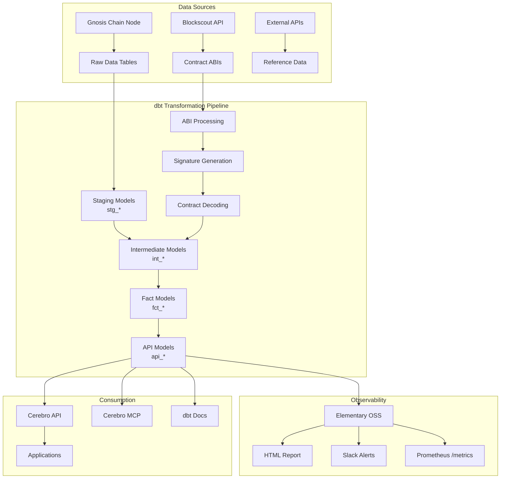
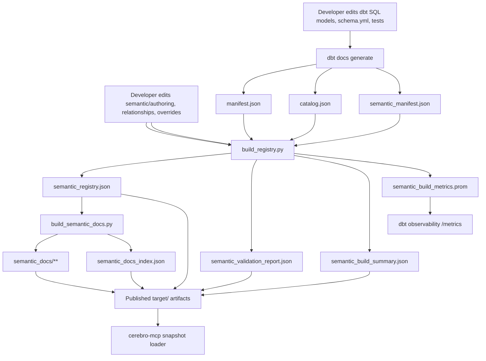
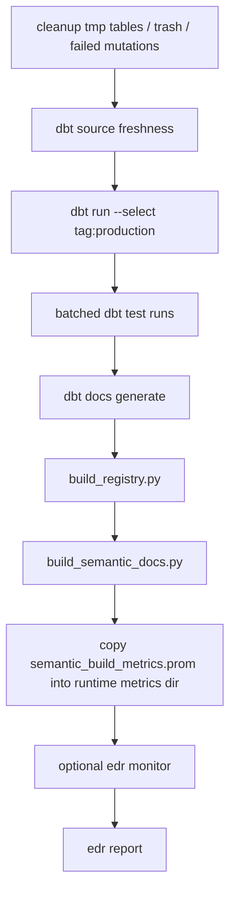
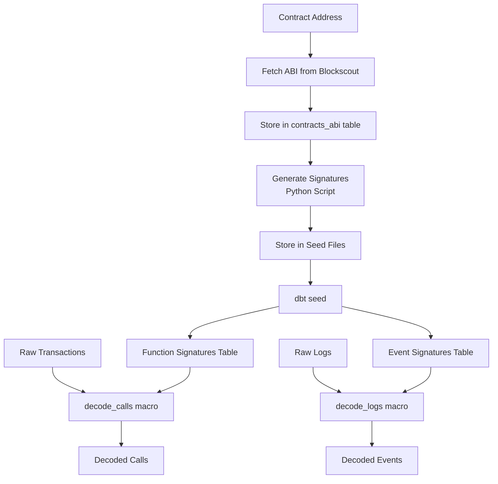

# Cerebro dbt - Gnosis Chain Analytics


A comprehensive [dbt](https://www.getdbt.com/) project for transforming and analyzing Gnosis Chain blockchain data. This project converts raw on-chain data into actionable insights across P2P networking, consensus mechanisms, execution layer activity, and environmental sustainability metrics.

## Table of Contents

- [Overview](#overview)
- [Architecture](#architecture)
- [Quick Start](#quick-start)
- [Environment Setup](#environment-setup)
- [Local Development](#local-development)
- [Semantic Layer Workflow](#semantic-layer-workflow)
- [Docker Deployment](#docker-deployment)
- [Data Modeling Conventions](#data-modeling-conventions)
- [Observability and Testing](#observability-and-testing)
- [Contract Decoding System](#contract-decoding-system)
- [Production Pipeline](#production-pipeline)
- [Project Structure](#project-structure)
- [Troubleshooting](#troubleshooting)

## Overview

Cerebro dbt transforms Gnosis Chain data across eight modules:

| Module | Description | Models |
|--------|-------------|--------|
| **execution** | Transaction analysis, token tracking, gas metrics, DeFi protocols, GPay wallet analytics | ~211 |
| **consensus** | Validator activity, block proposals, attestations, deposits/withdrawals, APY distributions | ~54 |
| **contracts** | Decoded smart contract events and calls (BalancerV2/V3, UniswapV3, Aave, Swapr, etc.) | ~44 |
| **p2p** | Peer-to-peer network topology, client distributions, crawl analytics (Discv4/Discv5) | ~27 |
| **bridges** | Cross-chain bridge flows, token net flows, Sankey visualizations | ~18 |
| **ESG** | Power consumption, carbon emissions, node classification, sustainability metrics | ~18 |
| **crawlers_data** | External datasets: Dune labels, prices, GNO supply | ~9 |
| **probelab** | ProbeLab network measurements: client versions, cloud distribution, QUIC support | ~9 |

All data is stored in **ClickHouse Cloud** and served via [Cerebro API](https://api.analytics.gnosis.io) and [Cerebro MCP](https://mcp.analytics.gnosis.io).

## Architecture


```mermaid
graph TD
    subgraph "Data Sources"
        A[Gnosis Chain Node] --> B[Raw Data Tables]
        C[Blockscout API] --> D[Contract ABIs]
        E[External APIs] --> F[Reference Data]
    end

    subgraph "dbt Transformation Pipeline"
        B --> G[Staging Models<br/>stg_*]
        G --> H[Intermediate Models<br/>int_*]
        H --> I[Fact Models<br/>fct_*]
        I --> J[API Models<br/>api_*]

        D --> K[ABI Processing]
        K --> L[Signature Generation]
        L --> M[Contract Decoding]
        M --> H
    end

    subgraph "Observability"
        J --> OBS[Elementary OSS]
        OBS --> REPORT[HTML Report]
        OBS --> SLACK[Slack Alerts]
        OBS --> METRICS[Prometheus /metrics]
    end

    subgraph "Consumption"
        J --> O[Cerebro API]
        J --> MCP[Cerebro MCP]
        J --> P[dbt Docs]
        O --> Q[Applications]
    end
```

## Quick Start

### Prerequisites

- Docker and Docker Compose
- ClickHouse Cloud account (or local ClickHouse instance)
- Python 3.10+ (for local development outside Docker)
- Git

### Basic Setup

```bash
# 1. Clone the repository
git clone https://github.com/gnosischain/dbt-cerebro.git
cd dbt-cerebro

# 2. Create environment file
cp .env.example .env
# Edit .env with your ClickHouse credentials

# 3. Build and start the Docker container
docker-compose up -d --build

# 4. Enter the container
docker exec -it dbt /bin/bash

# 5. Install dbt packages
dbt deps

# 6. Test connection
dbt debug

# 7. Run all production models
dbt run --select tag:production

# 8. Run tests
dbt test --select tag:production
```

## Environment Setup

### Configuration File (.env)

Create a `.env` file in the project root:

```bash
# ClickHouse Cloud Configuration
CLICKHOUSE_URL=your-clickhouse-cloud-host.com
CLICKHOUSE_PORT=8443
CLICKHOUSE_USER=default
CLICKHOUSE_PASSWORD=your-secure-password
CLICKHOUSE_SECURE=True
CLICKHOUSE_DATABASE=dbt

# Optional: Slack webhook for Elementary alerts
SLACK_WEBHOOK=https://hooks.slack.com/services/...

# Optional: Docker user mapping
USER_ID=1000
GROUP_ID=1000
```

### ClickHouse Requirements

- ClickHouse version 24.1 or later
- Schemas: `execution`, `consensus`, `nebula`, `nebula_discv4`, `crawlers_data`, `dbt`, `elementary`
- Appropriate read/write permissions across schemas

## Local Development

### Running Inside Docker (recommended)

Docker gives you the full environment with all dependencies pre-installed:

```bash
# Build and start
docker-compose up -d --build

# Enter the container
docker exec -it dbt /bin/bash

# Inside the container — all dbt and edr commands are available:
dbt deps
dbt compile
dbt run --select tag:production
dbt test --select tag:production
dbt source freshness
edr report --file-path /app/reports/elementary_report.html --target-path /app/edr_target
```

The docker-compose setup bind-mounts the repo into `/app`, so code changes are reflected immediately without rebuilding.

### Running Locally (without Docker)

```bash
# Create a virtual environment
python -m venv .venv
source .venv/bin/activate

# Install runtime dependencies
pip install -r requirements.txt

# Install dev dependencies (for migration scripts)
pip install -r requirements-dev.txt

# Set up profiles
mkdir -p ~/.dbt
ln -sf $(pwd)/profiles.yml ~/.dbt/profiles.yml

# Load environment variables
export $(cat .env | grep -v '^#' | xargs)

# Run dbt
dbt deps
dbt debug
dbt run --select tag:production
```

### Testing the Observability Server

The Dockerfile now includes a lightweight observability server that replaces the old `python -m http.server`. In production (Kubernetes), it serves `/health`, `/metrics`, and static report/log files.

To test it locally:

```bash
# Build the image
docker build -t dbt-cerebro:local .

# Run the observability server
docker run -p 8000:8000 dbt-cerebro:local

# In another terminal:
curl http://localhost:8000/health    # → {"status": "ok"}
curl http://localhost:8000/metrics   # → Prometheus text format
curl http://localhost:8000/           # → Service info JSON
```

### Testing the Full Pipeline Locally

```bash
docker exec -it dbt /bin/bash

# 1. Compile to verify all YAML is valid
dbt compile

# 2. Run source freshness checks
dbt source freshness

# 3. Run models
dbt run --select tag:production

# 4. Run all tests (including Elementary)
dbt test --select tag:production

# 5. Generate the Elementary report
edr report \
  --profiles-dir /home/appuser/.dbt \
  --project-dir /app \
  --file-path /app/reports/elementary_report.html \
  --target-path /app/edr_target

# 6. Open the report (from host, not container)
open reports/elementary_report.html  # macOS
# or: xdg-open reports/elementary_report.html  # Linux
```

### Running the Cron Orchestrator Locally

The production pipeline uses a shared orchestrator script. To test it locally:

```bash
docker exec -it dbt /bin/bash

# Preview mode (minimal mandatory steps)
/app/cron_preview.sh

# Production mode (all steps mandatory)
/app/cron.sh

# Or run the orchestrator directly with custom env
EDR_REPORT_ENV=dev /app/scripts/run_dbt_observability.sh
```

The orchestrator runs these steps in order:
1. `dbt source freshness` — check source data staleness
2. `dbt run --select tag:production` — run all production models
3. batched `dbt test` runs — execute model and Elementary tests without exhausting ClickHouse temp tables
4. `dbt docs generate` — refresh manifest, catalog, and semantic manifest artifacts
5. `python scripts/semantic/build_registry.py --target-dir target` — build semantic registry, validation report, summary, and Prometheus text metrics
6. `python scripts/semantic/build_semantic_docs.py --target-dir target` — build semantic docs pages and docs index
7. `edr monitor` — send Slack alerts (only when `SLACK_WEBHOOK` is set)
8. `edr report` — generate the HTML observability report

Each step's exit code is captured independently. The script never exits early — it always completes all steps, then prints a summary and exits non-zero if any mandatory step failed.

## Semantic Layer Workflow

The semantic layer in `dbt-cerebro` is not a second dbt project. It is a repository-local authoring and compilation system that sits next to normal dbt modeling.

### Naming and scope

The docs use three names that should not be mixed together:

- `dbt`: the upstream build toolchain, especially dbt Core, dbt docs artifacts, and MetricFlow validation
- `dbt-cerebro`: this repository, including its custom semantic authoring, compiler scripts, docs builder, and cron/orchestrator
- `cerebro-mcp`: the downstream runtime that later loads the published semantic artifacts

When this README says `Cerebro`, it means the broader product family. When it describes behavior in this repo, it should say `dbt-cerebro`.

The short version:

- dbt remains the source of truth for SQL models, sources, columns, tests, lineage, and generated artifacts such as `manifest.json` and `catalog.json`
- `dbt-cerebro` adds a richer semantic layer on top of those dbt artifacts using custom authoring in `semantic/authoring/**`
- the `dbt-cerebro` semantic compiler merges dbt artifacts plus semantic authoring into a stable registry, validation report, docs index, docs pages, and Prometheus build metrics
- the cron/orchestrator builds both layers together in the runtime environment, and CI publishes the static artifact set
- `cerebro-mcp` later consumes the published semantic artifacts at runtime

### Why the semantic flow is split from dbt

We originally tried placing the broad semantic surface directly under `models/**/semantic_models.yml`, but dbt `1.9.x` and MetricFlow validate every semantic model they see. That is good for a small approved MetricFlow surface, but it is too strict for the broader semantic authoring needs inside `dbt-cerebro`:

- candidate semantic models for every reviewable public model
- richer relationship metadata than dbt currently supports
- docs-only coverage for models that are not yet execution-safe
- broader naming and authoring iteration before something is approved

Because of that, the project now uses this rule:

- active semantic authoring lives in `semantic/authoring/**/semantic_models.yml`
- `semantic/relationships/*.yml` and `semantic/overrides/*.yml` hold `dbt-cerebro`-specific graph behavior and overrides
- `models/**/semantic_models.yml` is reserved for a future dbt-native-approved subset only after a model has been intentionally remodeled into a MetricFlow-valid shape
- today, there are no active semantic model files under `models/**`

This keeps `dbt docs generate` stable while still letting `dbt-cerebro` maintain full semantic coverage.

### New concepts

These are the key concepts behind the new flow.

- `semantic authoring`: the human-maintained semantic definitions in `semantic/authoring/**`
- `candidate`: scaffolded or partially reviewed semantics that exist for coverage and docs, but are not yet approved for public execution
- `approved`: a semantic model, metric, or relationship that has been explicitly reviewed and is allowed to drive runtime semantic execution
- `docs_only`: a model or source that still appears in the registry and docs, even if it has no executable semantics
- `relationship authoring`: curated join rules in `semantic/relationships/*.yml`; these are not inferred as approved from lineage alone
- `override authoring`: aliases, preferences, deprecations, and docs enrichment in `semantic/overrides/*.yml`
- `semantic registry`: the compiled artifact that combines dbt metadata and semantic authoring into one runtime-friendly document
- `semantic docs`: generated pages and a search index built from the registry
- `time spine`: the shared MetricFlow-compatible date spine that allows dbt semantic parsing and gives the `dbt-cerebro` semantic layer a standard daily backbone for cumulative and gap-filled logic

### What lives where

| Surface | Purpose | Owned by | Used by |
|-------|--------|---------|--------|
| `models/**` | SQL models, dbt docs/tests/lineage, time spine registration | `dbt-cerebro` dbt project | dbt and `dbt-cerebro` compiler |
| `semantic/authoring/**` | semantic models and metrics under review | `dbt-cerebro` semantic layer | registry/docs compiler |
| `semantic/relationships/*.yml` | curated graph edges and join safety rules | `dbt-cerebro` semantic layer | planner/runtime |
| `semantic/overrides/*.yml` | aliases, deprecations, docs enrichment, preferences | `dbt-cerebro` semantic layer | compiler/runtime/docs |
| `target/manifest.json`, `target/catalog.json`, `target/semantic_manifest.json` | dbt-generated metadata | dbt | registry compiler |
| `target/semantic_registry.json`, `target/semantic_docs/**` | runtime semantic artifacts | `dbt-cerebro` semantic compiler | `cerebro-mcp` |

### End-to-end flow


```mermaid
flowchart TD
    A["Developer edits dbt SQL models, schema.yml, tests"] --> B["dbt docs generate"]
    C["Developer edits semantic/authoring, relationships, overrides"] --> D["build_registry.py"]
    B --> E["manifest.json"]
    B --> F["catalog.json"]
    B --> G["semantic_manifest.json"]
    E --> D
    F --> D
    G --> D
    C --> D
    D --> H["semantic_registry.json"]
    D --> I["semantic_validation_report.json"]
    D --> J["semantic_build_summary.json"]
    D --> K["semantic_build_metrics.prom"]
    H --> L["build_semantic_docs.py"]
    L --> M["semantic_docs/**"]
    L --> N["semantic_docs_index.json"]
    M --> O["Published target/ artifacts"]
    N --> O
    H --> O
    I --> O
    J --> O
    K --> P["dbt observability /metrics"]
    O --> Q["cerebro-mcp snapshot loader"]
```

### dbt metadata flow and the dbt-cerebro semantic flow are running in parallel

The easiest mental model is:

- dbt builds the warehouse and emits metadata
- `dbt-cerebro` reads that metadata and adds a semantic layer on top

dbt is not aware of most `dbt-cerebro` semantic authoring. The semantic compiler is intentionally downstream of dbt.

That means:

- adding a new dbt model does not automatically make it an approved semantic model
- semantic coverage can advance without changing the SQL model itself
- semantic docs and semantic registry builds depend on `dbt docs generate`, but not the other way around
- failures in broad candidate semantics should not break `dbt docs generate`

### Manual intervention points

The semantic flow is not fully automatic on purpose. These are the places where people intervene.

1. Add or change a dbt model.
2. Regenerate dbt artifacts with `dbt docs generate`.
3. Scaffold missing candidate semantics with `scaffold_candidates.py`.
4. Review the scaffolded semantics and clean up vague names such as `value`, `label`, or raw field names that are not meaningful to users.
5. Decide whether the model stays `candidate`, becomes `approved`, or remains effectively docs-only.
6. Add curated relationships if the model must participate in cross-model semantic routing.
7. Rebuild and validate the registry before merge.

Things that are automatic:

- registry coverage for every first-party model and source
- docs page generation for compiled semantic artifacts
- Prometheus text metrics generation for semantic builds
- publication of semantic artifacts during the CI release flow

Things that are intentionally manual:

- approving a model for execution
- approving a metric for user-facing use
- approving a relationship for graph routing
- deciding if a model should ever become dbt-native-valid semantic YAML under `models/**`

### Local build flow

Use this sequence when working on semantics locally:

```bash
dbt docs generate
python scripts/semantic/scaffold_candidates.py --target-dir target
python scripts/semantic/scaffold_candidates.py --target-dir target --write
python scripts/semantic/report_candidates.py --target-dir target
python scripts/semantic/build_registry.py --validate --target-dir target
python scripts/semantic/build_semantic_docs.py --target-dir target
```

Generated semantic artifacts:

- `target/semantic_registry.json`
- `target/semantic_validation_report.json`
- `target/semantic_docs_index.json`
- `target/semantic_docs/`
- `target/semantic_build_summary.json`
- `target/semantic_build_metrics.prom`

Semantic parsing also depends on the shared MetricFlow time spine model in [schema.yml](/Users/hugser/Documents/Gnosis/repos/dbt-cerebro/models/shared/marts/schema.yml). Keep `dim_time_spine_daily` registered with `time_spine.standard_granularity_column: day` and `granularity: day` on the `day` column.

### Adding a future model

For every new analytical model:

1. Add the normal dbt SQL, docs, tests, and metadata.
2. Run `dbt docs generate`.
3. Run the scaffold generator and write the missing candidate into `semantic/authoring/`.
4. Review whether that model is a public semantic surface, an internal bridge, or docs-only coverage.
5. If it is public, add clear entities, dimensions, measures, and curated relationships.
6. Promote to `approved` only after explicit review.
7. Rebuild the registry, validation report, and semantic docs before merge.

### No-duplicates rule

The project now follows a strict no-duplicates rule:

- do not define the same semantic model in both `semantic/authoring/**` and `models/**`
- by default, keep semantic authoring only in `semantic/authoring/**`
- only move a definition into `models/**/semantic_models.yml` if it has been intentionally rewritten to satisfy dbt-native MetricFlow constraints
- when that future move happens, remove the duplicate from `semantic/authoring/**`

### What the cron/orchestrator actually does

Production does not just run dbt and stop. The orchestrator builds the semantic layer as part of the same operational run.

The script is [run_dbt_observability.sh](/Users/hugser/Documents/Gnosis/repos/dbt-cerebro/scripts/run_dbt_observability.sh), and the semantic portion of the flow is:


```mermaid
flowchart TD
    A["cleanup tmp tables / trash / failed mutations"] --> B["dbt source freshness"]
    B --> C["dbt run --select tag:production"]
    C --> D["batched dbt test runs"]
    D --> E["dbt docs generate"]
    E --> F["build_registry.py"]
    F --> G["build_semantic_docs.py"]
    G --> H["copy semantic_build_metrics.prom into runtime metrics dir"]
    H --> I["optional edr monitor"]
    I --> J["edr report"]
```

### What is automatic in cron vs what is not

Automatic in cron:

- regenerate dbt metadata artifacts
- rebuild semantic registry and docs artifacts
- emit semantic build metrics
- expose those metrics through the dbt observability server

Automatic in CI/release:

- run `dbt docs generate`
- rebuild semantic registry and semantic docs in a clean GitHub Actions environment
- publish the built `target/` directory to `gh-pages`

Not automatic in cron:

- semantic approvals
- relationship curation
- semantic naming cleanup
- promotion from candidate to approved

Cron builds whatever is already in the repo inside the deployed runtime. CI is what republishes the static artifact set externally. Neither path makes judgment calls.

### What gets published

After a successful CI docs deployment, the semantic system expects these published artifacts:

- `manifest.json`
- `catalog.json`
- `semantic_manifest.json`
- `semantic_registry.json`
- `semantic_validation_report.json`
- `semantic_docs_index.json`
- `semantic_build_summary.json`
- `semantic_build_metrics.prom`
- `semantic_docs/**`

`cerebro-mcp` later downloads those artifacts and builds its runtime semantic snapshot from them.

### Runtime semantic observability

The semantic build writes Prometheus text metrics into `target/semantic_build_metrics.prom`. The orchestrator copies that file into the runtime metrics directory, and the dbt observability server appends `.prom` files from runtime storage into `/metrics`.

That means the dbt service exposes:

- standard dbt observability information
- semantic build success/failure
- semantic build duration
- semantic coverage counts
- semantic validation warning/error counts

## Docker Deployment

### Container Services

The `docker-compose.yml` provides:

- **dbt Documentation Server**: Serves interactive documentation on port 8080
- **Isolated Python Environment**: All dependencies pre-installed
- **Volume Mounting**: Real-time code updates without rebuilding
- **Environment Management**: Automatic loading of `.env` variables

### Docker Commands

```bash
# Start services
docker-compose up -d

# View logs
docker-compose logs -f dbt

# Enter container for development
docker exec -it dbt /bin/bash

# Stop services
docker-compose down

# Rebuild container (after Dockerfile changes)
docker-compose build --no-cache

# Run dbt commands from outside container
docker exec dbt dbt run --select tag:production
docker exec dbt dbt test --select tag:production
docker exec dbt dbt source freshness
```

### Kubernetes Deployment

The preview and production deployments use Terraform in the [infrastructure repo](https://github.com/gnosischain/infrastructure-gnosis-analytics-deployments). Key differences from docker-compose:

- **Deployment pod**: Runs `app/observability_server.py` (health/metrics + static file serving)
- **CronJob**: Runs `cron_preview.sh` or `cron.sh` on a daily schedule (6 AM UTC)
- **dbt deps**: Baked into the image at build time (not run at container start)
- **Root filesystem**: Read-only in Kubernetes; writable paths via emptyDir volumes at `/data` and `/tmp`
- **Monitoring**: PodMonitor scrapes `/metrics` from the Deployment pod; CronJob uses kube-state-metrics

## Data Modeling Conventions

### Model Layers

| Layer | Prefix | Purpose | Materialization |
|-------|--------|---------|-----------------|
| Staging | `stg_` | Light transformations of raw source data | View |
| Intermediate | `int_` | Complex joins, aggregations, business logic | Incremental |
| Fact | `fct_` | Business-ready metrics and KPIs | View or incremental |
| API | `api_` | Models served via Cerebro API / MCP | View |

### Model Metadata Contract

Every model in `schema.yml` carries these meta fields:

```yaml
meta:
  owner: analytics_team           # Always analytics_team
  authoritative: false            # true for source-of-truth models
  full_refresh:                   # Optional — consumed by scripts/full_refresh/refresh.py
    start_date: "2021-01-01"
    batch_months: 6
    stages: [...]                 # Optional multi-stage batching
  inference_notes: "..."          # Optional documentation
```

Allowed meta keys: `owner`, `authoritative`, `full_refresh`, `inference_notes`. No other keys should be added to model meta.

### Source Metadata

Source files (`*_sources.yml`) carry freshness configuration:

```yaml
sources:
  - name: execution
    loaded_at_field: block_timestamp
    freshness:
      warn_after: {count: 26, period: hour}
      error_after: {count: 48, period: hour}
    meta:
      owner: analytics_team
      authoritative: true
```

| Source | Freshness SLA | Notes |
|--------|--------------|-------|
| `execution` | warn 26h / error 48h | Daily pipeline cadence |
| `consensus` | warn 26h / error 48h | Daily pipeline cadence |
| `p2p` (nebula) | warn 36h / error 72h | Crawl-based ingestion |
| `probelab` | warn 36h / error 72h | External rollups |
| `crawlers_data` (Dune) | Exempt | No reliable timestamp |

## Observability and Testing

### Elementary OSS

[Elementary](https://www.elementary-data.com/) is the primary data observability layer. It provides anomaly detection, schema change monitoring, freshness tracking, and an interactive HTML report.

**Package version**: 0.22.1 (in `packages.yml` and `requirements.txt`)

### Test Coverage Summary

| Metric | Count |
|--------|-------|
| Total models | 354 |
| Models with Elementary tests | 281 |
| Volume anomaly tests | 132 |
| Freshness anomaly tests | 132 |
| Schema change tests | 281 |
| Column anomaly tests | 108 |
| Sources with freshness | 4 (+ 1 exempt) |

### Elementary Test Types by Model Class

| Model Class | Count | Elementary Tests | Notes |
|-------------|-------|-----------------|-------|
| Daily (`*_daily`) | 121 | volume + freshness + column anomalies + schema changes | Primary observability targets |
| Hourly (`*_hourly`) | 6 | volume + freshness (3.5 sensitivity) | Higher sensitivity for faster cadence |
| Weekly (`*_weekly`) | 17 | volume + freshness (26-week training) | Longer training window |
| Monthly (`*_monthly`) | 26 | schema changes only | Too few data points for anomaly detection |
| Latest/Snapshot | 77 | schema changes only | Point-in-time; no time-series anomalies |
| Event grain (contracts) | 44 | schema changes only | All have `full_refresh`; skip volume/freshness |
| Non-time-series | 34 | schema changes on api\_/fct\_ prefixed | Reference tables, static lookups |
| Staging (`stg_*`) | 29 | None | Tested at source level |

### Test Parameters by Cadence

**Daily models** (the dominant pattern):
- `volume_anomalies`: time_bucket=day, training=56 days, seasonality=day_of_week, sensitivity=3, ignore_small_changes 10/20
- `freshness_anomalies`: time_bucket=day
- `column_anomalies`: null_count, min, max on KPI columns (value, cnt, total, txs, gas_used, etc.)

**Hourly models**:
- `volume_anomalies`: time_bucket=hour, training=21 days, seasonality=hour_of_week, sensitivity=3.5, ignore_small_changes 15/25

**Weekly models**:
- `volume_anomalies`: time_bucket=week, training=26 weeks

### Severity Rules

- **`warn` (default)**: All Elementary anomaly tests, column anomalies, schema changes on internal models
- **`error`**: Source freshness failures, primary-key/grain failures, schema changes on `api_*` models, anomalies on tier-0 critical models (execution blocks/transactions)

### Full Refresh Models

59 models have `meta.full_refresh` configuration (used by `scripts/full_refresh/refresh.py` for batched rebuilds). These models **skip volume and freshness anomalies** entirely to avoid false alerts during staged backfills. They retain schema change and integrity tests.

### Running Tests

```bash
# All tests
dbt test

# Only Elementary tests
dbt test --select tag:elementary

# Tests for a specific module
dbt test --select consensus

# Source freshness
dbt source freshness

# Generate the Elementary report
edr report \
  --profiles-dir /home/appuser/.dbt \
  --project-dir /app \
  --file-path /app/reports/elementary_report.html \
  --target-path /app/edr_target

# Send Slack alerts (requires SLACK_WEBHOOK env var)
edr monitor \
  --profiles-dir /home/appuser/.dbt \
  --project-dir /app \
  --group-by table \
  --suppression-interval 24
```

### Elementary Report

The report is generated as `reports/elementary_report.html` — an interactive single-file dashboard showing:
- Test results and pass/fail history
- Anomaly detection charts with training data
- Source freshness status
- Schema change diffs
- Model-level test coverage

### Classification Artifact

All 354 models are classified in `scripts/analysis/elementary_model_classification.csv` with columns:
`model_name`, `schema_file`, `module`, `tags`, `tier`, `class`, `timestamp_column`, `has_full_refresh`, `has_existing_elementary_tests`, `rollout_wave`, `anomaly_enabled`, `kpi_columns`, `dimension_columns`, `schema_change_enabled`, `notes`

### Migration Scripts

One-time scripts used to roll out the observability layer (committed for auditability):

| Script | Purpose |
|--------|---------|
| `scripts/cleanup_schema_meta.py` | Remove schema-gen noise, normalize owners to `analytics_team` |
| `scripts/classify_models.py` | Classify all models by cadence/type, emit CSV |
| `scripts/add_elementary_tests.py` | Idempotent YAML patcher: add Elementary tests per classification |

All support `--dry-run`. Require `ruamel.yaml` (`pip install -r requirements-dev.txt`).

### MCP Integration

All test and metadata definitions in `schema.yml` compile into `manifest.json`, which is served at `https://gnosischain.github.io/dbt-cerebro/manifest.json`. The [Cerebro MCP](https://github.com/gnosischain/cerebro-mcp) service reads the manifest and exposes model metadata, test coverage, owner information, and full_refresh configuration through its tools (`search_models`, `get_model_details`, `discover_models`).

## Contract Decoding System

### Overview

The contract decoding system transforms raw blockchain data into human-readable formats:


```mermaid
graph TD
    A[Contract Address] --> B[Fetch ABI from Blockscout]
    B --> C[Store in contracts_abi table]
    C --> D[Generate Signatures<br/>Python Script]
    D --> E[Store in Seed Files]
    E --> F[dbt seed]
    F --> G[Function Signatures Table]
    F --> H[Event Signatures Table]

    I[Raw Transactions] --> J[decode_calls macro]
    K[Raw Logs] --> L[decode_logs macro]

    G --> J
    H --> L

    J --> M[Decoded Calls]
    L --> N[Decoded Events]
```

### Adding New Contracts

```bash
docker exec -it dbt /bin/bash

# 1. Fetch ABI
dbt run-operation fetch_and_insert_abi --args '{"address": "0xContractAddress"}'

# 2. Export ABIs to CSV (CRITICAL: prevents data loss on next dbt seed)
python scripts/abi/export_contracts_abi.py

# 3. Generate signature files
python scripts/signatures/signature_generator.py

# 4. Load seeds
dbt seed

# 5. Create model SQL and schema.yml entry, then run
dbt run --select your_contract_events
```

## Production Pipeline

### Daily Cron Job

The production pipeline runs daily at 6 AM UTC via a Kubernetes CronJob:

```
dbt source freshness → upload freshness → dbt run → dbt test → edr monitor → edr report
```

### Cron Scripts

| Script | Environment | Mandatory Steps |
|--------|-------------|-----------------|
| `cron_preview.sh` | Preview (dev) | dbt run, edr report |
| `cron.sh` | Production | dbt run, dbt test, source freshness, upload, edr report, edr monitor |

Both are thin wrappers around `scripts/run_dbt_observability.sh`, which captures per-step exit codes and never exits early.

### Full Refresh Orchestrator

For batched backfills of large models, use the full refresh orchestrator:

```bash
# Dry run — preview the batch plan
python scripts/full_refresh/refresh.py --select int_execution_tokens_balances_daily --dry-run

# Execute with resume support
python scripts/full_refresh/refresh.py --select int_execution_tokens_balances_daily --resume
```

See [scripts/full_refresh/README.md](scripts/full_refresh/README.md) for configuration details.

## Project Structure

```
dbt-cerebro/
├── app/
│   └── observability_server.py    # Health + metrics + static file server (k8s)
├── models/
│   ├── consensus/                 # Consensus layer (54 models)
│   │   ├── staging/               # stg_consensus__*
│   │   ├── intermediate/          # int_consensus_*
│   │   └── marts/                 # fct_consensus_*, api_consensus_*
│   ├── execution/                 # Execution layer (211 models)
│   │   ├── blocks/
│   │   ├── transactions/
│   │   ├── tokens/
│   │   ├── gpay/
│   │   ├── state/
│   │   ├── transfers/
│   │   ├── prices/
│   │   ├── yields/
│   │   ├── rwa/
│   │   ├── Circles/
│   │   └── GBCDeposit/
│   ├── contracts/                 # Decoded contracts (44 models)
│   │   └── {Protocol}/            # One folder per protocol
│   ├── p2p/                       # P2P network (27 models)
│   ├── bridges/                   # Bridge flows (18 models)
│   ├── ESG/                       # Sustainability (18 models)
│   ├── crawlers_data/             # External data (9 models)
│   └── probelab/                  # ProbeLab (9 models)
├── macros/
│   ├── db/                        # Database utilities (incremental filters)
│   └── decoding/                  # Contract decoding macros
├── seeds/                         # Static reference data
│   ├── contracts_abi.csv
│   ├── contracts_whitelist.csv
│   ├── tokens_whitelist.csv
│   ├── event_signatures.csv
│   └── function_signatures.csv
├── scripts/
│   ├── full_refresh/              # Batched backfill orchestrator
│   ├── analysis/                  # Model classification CSV
│   ├── cleanup_schema_meta.py     # Meta cleanup migration
│   ├── classify_models.py         # Model classifier
│   ├── add_elementary_tests.py    # Test rollout script
│   └── run_dbt_observability.sh   # Shared cron orchestrator
├── cron.sh                        # Production cron wrapper
├── cron_preview.sh                # Preview cron wrapper
├── Dockerfile
├── docker-compose.yml
├── packages.yml                   # dbt packages (dbt_utils, elementary)
├── profiles.yml                   # dbt + elementary profiles
├── requirements.txt               # Runtime Python deps
└── requirements-dev.txt           # Dev/migration deps (ruamel.yaml)
```

## Troubleshooting

### Common Issues

#### dbt compile fails after schema changes

```bash
# Verify all YAML is valid
dbt compile

# If a schema.yml has syntax errors, check with:
python -c "from ruamel.yaml import YAML; YAML().load(open('models/path/to/schema.yml'))"
```

#### Elementary report generation fails

```bash
# Check the elementary profile resolves correctly
dbt debug --target ch_dbt --profiles-dir /home/appuser/.dbt

# Verify elementary tables exist
# The elementary schema should contain: dbt_run_results, elementary_test_results, etc.
# Bootstrap Elementary models if missing:
dbt run --select elementary
```

#### Source freshness shows errors on exempt tables

Tables with `freshness: null` in their source YAML are skipped. If a table unexpectedly fails freshness:
1. Check `models/*_sources.yml` for the table's freshness config
2. Verify `loaded_at_field` points to a valid timestamp column
3. Check if the source data has been ingested recently

#### Full refresh model triggers false Elementary alerts

All 59 `meta.full_refresh` models skip `volume_anomalies` and `freshness_anomalies` by design. If you see false alerts, verify:
1. The model has `meta.full_refresh` in its `schema.yml`
2. Re-run `scripts/classify_models.py` to update the classification CSV
3. Re-run `scripts/add_elementary_tests.py` (idempotent — safe to re-run)

#### Docker container won't start

```bash
# Check logs
docker-compose logs -f dbt

# Verify environment variables
docker exec dbt env | grep CLICKHOUSE

# Test connection
docker exec dbt dbt debug
```

## License

This project is licensed under the [MIT License](LICENSE).
