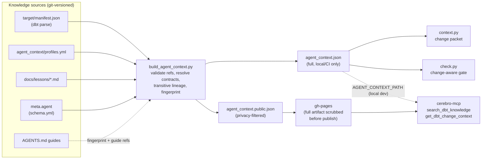
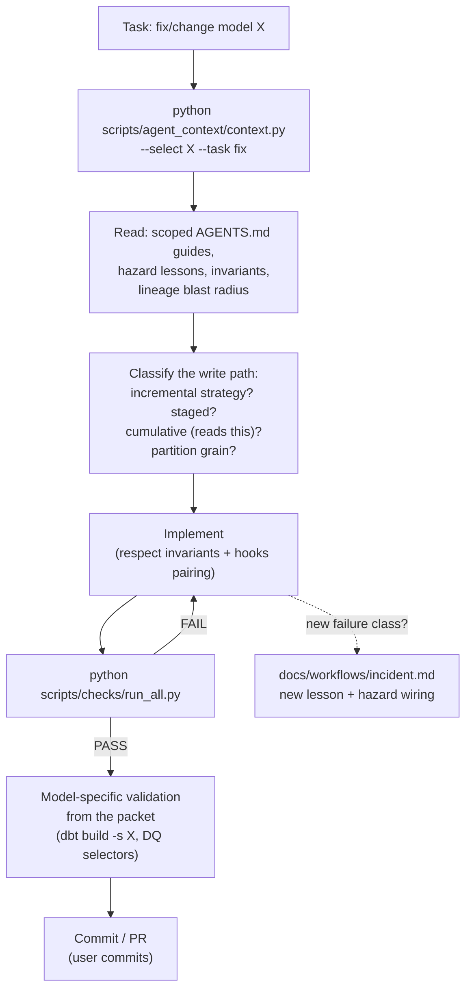
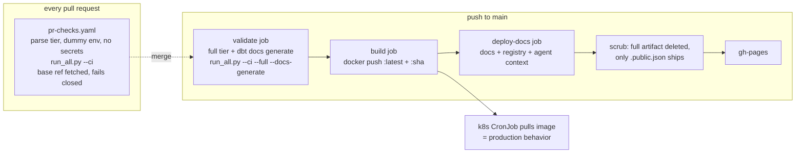
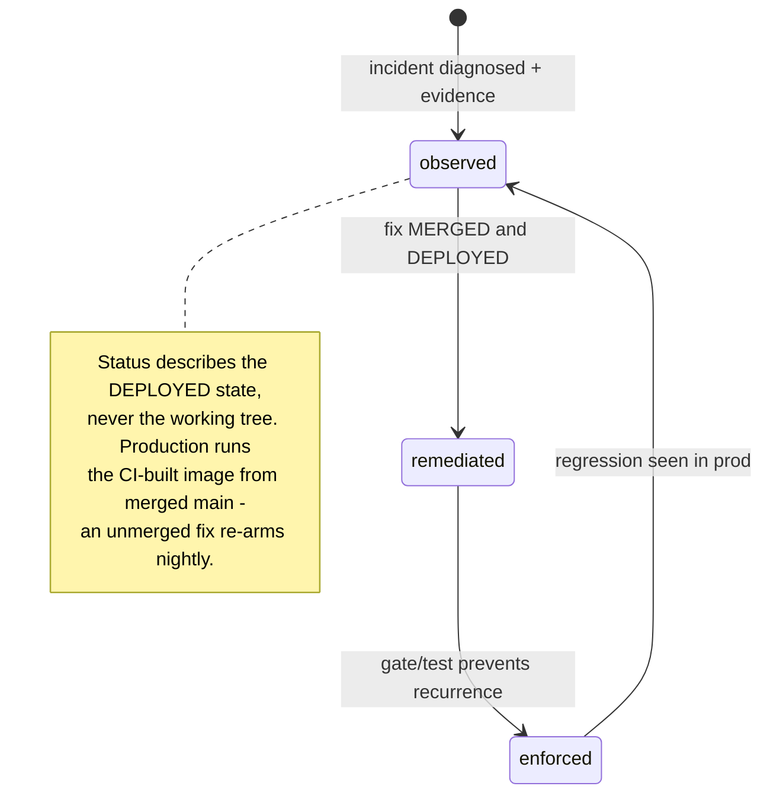

# The Agent Knowledge System

How this repo makes model work safe for agents (and humans): every model change
starts from a **machine-resolved change packet**, is bounded by **lesson records**
of past incidents, and is gated by **policy checks that cannot be skipped** —
locally, on every PR, and before any production image publishes.

This is the architecture reference. The operational entry point for an agent is
[AGENTS.md](../AGENTS.md) (read that first when *doing* work); this document
explains how the machinery behind it fits together.

- [Why it exists](#why-it-exists)
- [Component map](#component-map)
- [The artifact pipeline](#the-artifact-pipeline)
- [Contract resolution](#contract-resolution)
- [Policy gates and the ratchet philosophy](#policy-gates-and-the-ratchet-philosophy)
- [Typical flows](#typical-flows)
- [CI: two validation tiers](#ci-two-validation-tiers)
- [Lesson lifecycle](#lesson-lifecycle)
- [MCP serving](#mcp-serving)
- [Command quick reference](#command-quick-reference)

## Why it exists

The same mistake classes kept recurring: staged batches wiping partitions,
appends doubling populated months, cumulative chains backfilled in the wrong
order, sparse tables that can never overwrite a stale key with zero. Each was
diagnosed at high cost — and then re-committed by the next session that lacked
the context.

The system turns that experience into three enforceable layers:

1. **Context** — before touching a model, an agent gets its resolved contract:
   grain, invariants, hazards (linked to lesson records), lineage blast radius,
   and the safe reprocess runbook.
2. **Knowledge** — incidents become `docs/lessons/` records with evidence and a
   status lifecycle, indexed and searchable (locally and over MCP).
3. **Enforcement** — the non-negotiable rules are static gates with shrink-only
   exemption ratchets, wired into one runner that CI executes before any image
   is published.

## Component map

| File / dir | Role |
|---|---|
| [`AGENTS.md`](../AGENTS.md) | Root operating guide: required workflow, refresh-lever table, non-negotiable rules, ClickHouse gotchas. The entry point for any agent. |
| `models/*/AGENTS.md`, `scripts/*/AGENTS.md` | Scoped guides — domain invariants next to the code they govern (contracts, execution, gnosis_app_gt, revenue, consensus, mixpanel_ga, quarterly_data, celo, bridges, refresh runners). Domains without one follow root rules. |
| [`CLAUDE.md`](../CLAUDE.md) | Thin shim that loads AGENTS.md for Claude Code. No content of its own. |
| [`docs/lessons/`](lessons/INDEX.md) | Mistake-class records: symptom, root cause, forbidden action, detection, safe remediation, evidence, status (`observed → remediated → enforced`). INDEX.md is the catalog. |
| [`docs/workflows/`](workflows/) | Vendor-neutral step-by-step workflows: [new-model](workflows/new-model.md), [generate-schema](workflows/generate-schema.md), [refresh-advisor](workflows/refresh-advisor.md), [incident](workflows/incident.md). |
| `.claude/commands/*.md` | 3-line wrappers exposing the workflows as slash commands. Adapters only — the workflows are authoritative. |
| [`agent_context/profiles.yml`](../agent_context/profiles.yml) | Scope profiles: class rules matched against manifest facts (path, materialization, strategy, `{{ this }}`, tags…). Profiles carry rules, hazards, guides, runbooks — never model-name enumerations. |
| `agent_context/contract_ratchet.allow` | Ratchet file for the changed-model contract gate. |
| `models/**/schema.yml` → `meta.agent` | Per-model explicit contract (grain, invariants, hazards, validation, reprocess_runbook). Highest-priority resolution layer. |
| [`scripts/agent_context/build_agent_context.py`](../scripts/agent_context/build_agent_context.py) | Builder: manifest + profiles + lessons + meta.agent → `target/agent_context.json` (+ privacy-filtered `.public` variant). Validates every hazard/lesson reference. |
| [`scripts/agent_context/context.py`](../scripts/agent_context/context.py) | Prints a model's **change packet**. Auto-rebuilds a stale artifact; unknown models get a degraded packet instead of an error. |
| [`scripts/agent_context/check.py`](../scripts/agent_context/check.py) | Change-aware gate: diffs vs a base ref, prints per-changed-model contracts/impact, blocks high-risk changes without contracts and changed models unknown to the artifact. |
| [`scripts/agent_context/strategy.py`](../scripts/agent_context/strategy.py) | Shared raw-code strategy detection (the manifest's resolved config collapses `('append' if start_month else 'insert_overwrite')` to its default branch — only raw code can tell safe from dangerous). Used by both the builder and the incremental gate. |
| [`scripts/agent_context/guard.py`](../scripts/agent_context/guard.py) | Vendor-neutral shell-command guard (dangerous dbt/refresh invocations). `.claude/hooks/bash_guard.py` is its Claude adapter. |
| [`scripts/checks/run_all.py`](../scripts/checks/run_all.py) | THE verification command — runs every gate (see below) with a PASS/FAIL summary. `make check-fast` / `make check` are aliases. |
| `scripts/checks/*.py` + `*.allow` | Individual gates with shrink-only exemption files (see [gate table](#policy-gates-and-the-ratchet-philosophy)). |
| [`tests/test_policy_gates.py`](../tests/test_policy_gates.py) | The gate contracts as fixture tests — including the four canonical violations CI must reject. |
| `target/agent_context.json` / `.public.json` | The build outputs (schema v2). The full artifact is local/CI-only; only the privacy-filtered public variant is ever published. |
| `.github/workflows/pr-checks.yaml`, `build-and-release.yaml` | The two CI tiers (see [CI](#ci-two-validation-tiers)). |
| cerebro-mcp `loaders/agent_context.py`, `tools/analytics/agent_knowledge.py` | Serves the artifact to any MCP agent: `search_dbt_knowledge`, `get_dbt_change_context`. |

## The artifact pipeline

Everything derives from the manifest — no hand-maintained model lists, no counts
in prose. Change a lesson, a profile, a guide, or any model and the artifact
fingerprint changes, forcing a rebuild on next use.



Key artifact properties (schema v2):

- `incremental_strategy` is only recorded for incremental models — the
  project-wide `+incremental_strategy` default would otherwise attach
  partition-overwrite hazards to every view.
- `strategy_expression` / `strategy_scoped_append` come from **raw model code**
  (both resolved and unrendered config collapse `config()` expressions at parse
  time).
- `downstream_api_models` is the **transitive** api_ descendant set (list
  capped, `downstream_api_count` carries the true total);
  `downstream_direct_count` / `downstream_transitive_count` size the blast
  radius.
- `agents_md` is a **list**: a staged decode model carries both the contracts
  guide and the full-refresh guide.
- The public variant drops models with privacy tags or `meta.expose_to_mcp:
  false` (direct or nested) and never contains raw SQL.
- `models_hash` + `inputs_fingerprint` make staleness detectable by every
  consumer; output is deterministic (CI proves it by double-build comparison).

## Contract resolution

A model's contract is resolved in layers, most specific last:

```
global (profiles.yml `global`)          rules that apply to every model
  → matching profiles, in file order    class rules: decode, incremental,
                                        staged, cumulative, api, domain trees…
    → the model's meta.agent            explicit grain/invariants/hazards
```

List fields (`rules`, `hazards`, `validation`, `invariants`) merge with
de-duplication; `agents_md` accumulates; scalar fields (`grain`, `semantics`,
`ground_truth`, `reprocess_runbook`) are overridden by later layers. Hazards are
attached with their lesson **status inline**, so a consumer sees at a glance
whether a hazard is merely observed or already enforced.

Models are classified **high-risk** when incremental, under `models/contracts/`,
reading `{{ this }}`, or carrying `meta.full_refresh` stages. A *changed*
high-risk model without an explicit `meta.agent` contract fails `check.py`
(ratcheted via `contract_ratchet.allow`); untouched legacy gaps are reported,
and `--strict` escalates them.

## Policy gates and the ratchet philosophy

Every "non-negotiable" rule in AGENTS.md is backed by a gate. Pre-existing
violations are grandfathered in per-gate `.allow` files that are **shrink-only**:
an allow entry that stops suppressing a violation *fails the build* until the
line is deleted, so backlogs can only go down, and every gate prints its
remaining exemption count (no silent caps).

| Gate | Rejects | Ratchet file |
|---|---|---|
| `no_delete_insert.py` | `delete+insert` strategies; `insert_overwrite` without `partition_by`; bare `append` without the `microbatch` tag; **staged models whose raw strategy is a literal/inherited `insert_overwrite` or whose scoped branch isn't `append`** (the June-2026 wipe class, detected from raw code via `strategy.py`) | `no_delete_insert.allow` (`uid` or `uid::rule`) |
| `check_api_tags.py` | endpoint-convention violations (grain-free `api:` tag, one `granularity:`, a tier, complete typed columns, grain/freshness column); **`api_*`-named models that neither enter the convention nor set `meta.api.exclude_from_api: true`** | `check_api_tags.allow` (`name::rule`) |
| `check_meta_keys.py` | generator-noise meta keys (`generated_by`, `_generated_at`, `_generated_fields`). Deliberately a **denylist** — real meta contracts (`api`, `privacy_tier`, `expose_to_mcp`, `grain`, `guard`, …) must pass. Prints the full key census. | — |
| `check_doc_coverage.py` | per-module description/ownership coverage regressions (floors only ratchet up) | `doc_coverage_floors.json` |
| `envio_ga_policy.py` | envio_ga models: incremental without `partition_by`; stretch-table readers without the `stretch` tag | `envio_ga_policy.allow` |
| `scaffold_candidates.py --gate` | tracked `api_/fct_/int_` models with no semantic authoring | `semantic/authoring/scaffold_gate.allow` |
| `check.py` | changed high-risk models without contracts; **changed models unknown to the artifact** (stale artifact or never parsed — fail closed, hazards can't be checked). Deleted model files are reported but never block — nothing is left to hazard-check, and dangling refs/metrics are caught by dbt parse and the semantic-registry gate | `contract_ratchet.allow` |
| `build_agent_context.py` | unknown lesson/hazard references, unknown `meta.agent` keys, unparseable lesson frontmatter, non-deterministic output | — |
| `tests/test_policy_gates.py` | any drift in the gate contracts themselves — including the four canonical violations: a new delete+insert incremental, an untagged `api_` model, an unauthored tracked mart, a staged literal `insert_overwrite` | — |

All of it runs through **one command**:

```bash
python scripts/checks/run_all.py           # parse tier (no warehouse needed)
python scripts/checks/run_all.py --fast    # static gates only
python scripts/checks/run_all.py --full    # + semantic registry/graph/entities
```

It bootstraps `target/manifest.json` (`dbt parse`) when missing or stale, proves
artifact determinism by building twice, and runs pytest with
`PYTEST_DISABLE_PLUGIN_AUTOLOAD=1` (third-party pytest plugins break collection
in the dbt container otherwise).

## Typical flows

### Changing an existing model



The packet is the contract: if it flags the model CUMULATIVE, history is
backfilled chronologically first; if the strategy is an expression, the branch
a given invocation takes is verified before running; the listed validation
selectors are the definition of done.

### New model

Follow [docs/workflows/new-model.md](workflows/new-model.md) — the shape is:
scoped guide + lessons → SQL config conventions → seed once with
`--full-refresh` and verify rows → schema.yml (+ `meta.agent` if high-risk,
`meta.full_refresh` with the append-if-`start_month` expression if staged) →
semantic authoring (the scaffold gate fails new unauthored marts) → `dbt parse`
so the artifact knows the model (check.py blocks unknown changed models) →
`run_all.py` → `dbt build`.

### Backfill / refresh

Follow [docs/workflows/refresh-advisor.md](workflows/refresh-advisor.md): the
packet (`--task backfill`) + pending run-state check + downstream
cumulative/stateless classification pick the lever from the AGENTS.md decision
table. Run state is identity-keyed under `target/refresh_state/` —
`refresh.py` refuses overlapping starts.

### Incident → lesson

Follow [docs/workflows/incident.md](workflows/incident.md): evidence first,
then the record, then wiring (profile or `meta.agent` hazards + a
`tests/data_quality/` detection test where possible), then rebuild the
artifact. A lesson without evidence is a rumor; a fix that exists only in the
working tree is at most `observed` (see [lifecycle](#lesson-lifecycle)).

## CI: two validation tiers

`dbt parse` needs no warehouse, so every static gate runs on any checkout. The
semantic registry/graph/entity gates hard-require `target/catalog.json`, which
only a credentialed `dbt docs generate` produces — that split defines the tiers:



Two properties matter:

- **No image before validation.** `build` has `needs: validate` — a bad model
  cannot reach the production cron, and a bad PR fails before merge.
- **Fail closed.** In CI, an unresolvable diff base is an error
  (`--require-base`), a stale manifest is an error, and a changed model the
  artifact doesn't know is an error. An empty changed-set produced by a broken
  diff would otherwise silently pass everything.

## Lesson lifecycle



`proposed` exists for ideas with no instance yet. The status is attached inline
to every hazard in every change packet, so consumers always see whether a
hazard is still live.

## MCP serving

cerebro-mcp serves the artifact to any connected agent:

- **`search_dbt_knowledge(query, model_name?)`** — keyword search over lesson
  records (title/symptom/scope/body weighted, exact-phrase boost, and a boost
  for lessons in the asking model's hazard list). Top hit returns the full
  record including detection + safe remediation.
- **`get_dbt_change_context(models, task)`** — the change packet over MCP:
  contract, hazards with status, transitive api impact, runbook, validation.

The loader accepts artifact schema v1 **and** v2 (normalizing on load — v2
publishes only after consumers accept it), prefers a local
`AGENT_CONTEXT_PATH` over the gh-pages URL, and recomputes `models_hash`
against the live manifest: when they diverge, per-model contracts are
suppressed with a warning (a stale contract asserting the wrong grain is worse
than none) while lessons — which describe the repo, not one manifest — keep
serving. An eval corpus (`tests/test_agent_knowledge_eval.py`) gates
publication: every acceptance scenario must rank its lesson in the top 3.

## Command quick reference

```bash
# Before touching a model — the change packet
python scripts/agent_context/context.py --select <model> --task <build|fix|backfill|review>

# What did this branch change and what could it break
python scripts/agent_context/check.py --base-ref main            # make impact

# THE verification command (parse tier / static / full)
python scripts/checks/run_all.py                                 # make: —
python scripts/checks/run_all.py --fast                          # make check-fast
python scripts/checks/run_all.py --full                          # make check

# Rebuild the context artifact explicitly
python scripts/agent_context/build_agent_context.py              # make agent-context

# Individual gates (all included in run_all)
python scripts/checks/no_delete_insert.py
python scripts/checks/check_api_tags.py
python scripts/checks/check_meta_keys.py
python scripts/semantic/scaffold_candidates.py --gate

# Refresh manifest via the dbt container
make manifest
```
