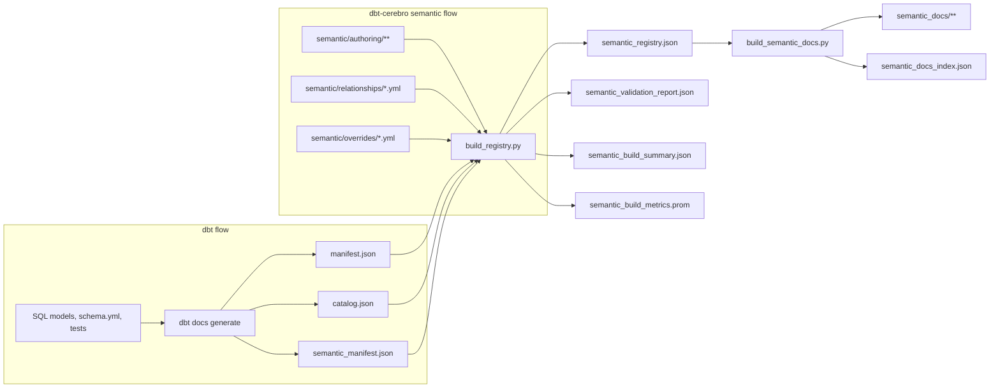
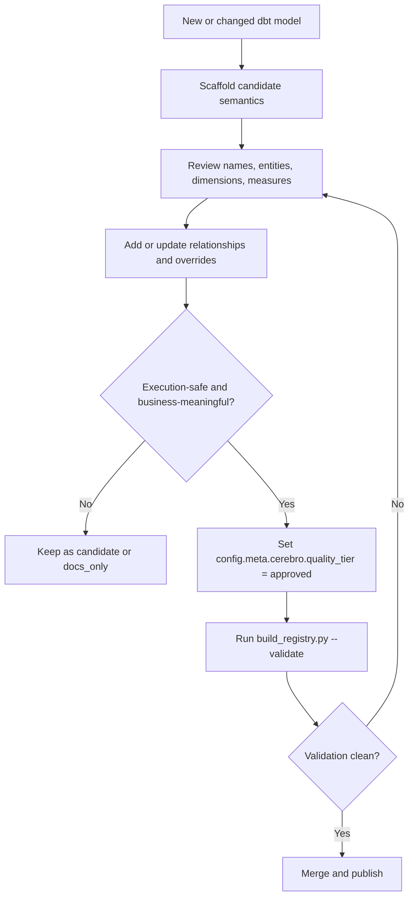
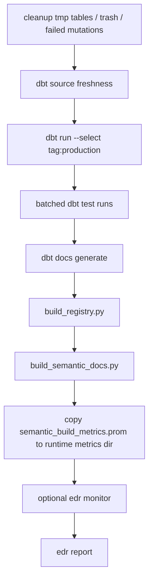

# Semantic Authoring Runbook

This is the canonical operating guide for the semantic layer in `dbt-cerebro`.

It explains:

- what the semantic layer is
- why it is split from normal dbt authoring
- where files live
- what is automatic versus manual
- what the cron/orchestrator builds and publishes
- how to add, review, approve, and release future semantic models safely

## 0. Naming and scope

This repo sits inside a larger product family, so the names matter.

In this runbook:

- `dbt` means the upstream toolchain: dbt Core, dbt docs artifacts, and MetricFlow validation
- `dbt-cerebro` means this repository and its custom semantic compiler, authoring layout, docs generator, and cron/orchestrator
- `cerebro-mcp` means the downstream runtime that loads the published semantic artifacts
- `Cerebro` should only be read as the broader platform family, not as shorthand for every repo

If a sentence is about files or scripts in this repository, it should usually say `dbt-cerebro`, not just `Cerebro`.

## 1. The semantic system in one sentence

`dbt-cerebro` uses dbt to build warehouse models and metadata, then uses a custom `dbt-cerebro` semantic compiler to turn that dbt metadata plus semantic authoring into runtime artifacts for `cerebro-mcp`.

## 2. Why this exists

Normal dbt metadata gives us:

- SQL models
- sources
- lineage
- column metadata
- tests
- generated artifacts such as `manifest.json` and `catalog.json`

That is necessary, but it is not enough for downstream Cerebro runtimes such as `cerebro-mcp`. The semantic layer in `dbt-cerebro` also needs:

- a stable semantic registry for every first-party model and source
- candidate semantic coverage even before a model is fully approved
- curated cross-model relationships
- semantic status such as `candidate`, `approved`, and `docs_only`
- semantic docs pages and a search index
- graph planning metadata for later runtime execution

dbt and MetricFlow can represent some of this, but not all of it, and dbt `1.9.x` validates every semantic model it sees. That validation is useful for a small approved MetricFlow surface, but it is too strict for the wider coverage we want to keep in repo while models are still being reviewed.

So the project deliberately separates:

- dbt-native metadata generation
- `dbt-cerebro` semantic authoring and compilation

## 3. Current architecture

The current architecture is:

- dbt authoring stays in `models/**`
- semantic authoring lives in `semantic/authoring/**/semantic_models.yml`
- curated relationship rules live in `semantic/relationships/*.yml`
- curated overrides live in `semantic/overrides/*.yml`
- the semantic compiler reads dbt artifacts plus those semantic files and emits runtime artifacts into `target/`

Important current rule:

- there are currently no active `models/**/semantic_models.yml` files in the repo

That is intentional. We removed them so `dbt docs generate` can stay stable while the full candidate semantic surface is maintained outside dbt's parser path.

## 4. The core concepts

### 4.1 Semantic authoring

Semantic authoring means the hand-maintained YAML that describes:

- entities
- dimensions
- measures
- metrics
- semantic status and metadata

This authoring lives under:

- `semantic/authoring/<module>/semantic_models.yml`
- `semantic/authoring/execution/<submodule>/semantic_models.yml`

### 4.2 Candidate

A `candidate` semantic model exists so the project has broad semantic coverage without falsely claiming production readiness.

Candidate models are allowed to be:

- scaffolded
- incomplete
- not yet fully named for end users
- missing approved relationships
- useful for docs and review, but not yet safe for public execution

### 4.3 Approved

An `approved` semantic model, metric, or relationship has been explicitly reviewed and is allowed to participate in runtime semantic execution.

Approval is a human decision. It is never inferred automatically from:

- model naming
- lineage
- scaffolding
- the fact that a model exists in dbt

### 4.4 Docs-only

`docs_only` means the model or source still appears in the semantic registry and semantic docs, but it does not expose executable semantics.

This matters because we still want:

- full lineage
- searchable model pages
- registry coverage for every first-party node

even when a model is not approved for semantic execution.

### 4.5 Relationships

Relationship authoring defines how the semantic graph is allowed to move between models.

Relationship files live in:

- `semantic/relationships/*.yml`

They capture things that lineage alone cannot safely decide, such as:

- left and right keys
- cardinality
- whether a relationship is safe for enrichment
- whether a relationship must use aggregate-then-join only
- whether `ANY LEFT JOIN` is ever allowed
- whether a path is a preferred bridge

### 4.6 Overrides

Override files live in:

- `semantic/overrides/*.yml`

They capture semantic corrections and preferences such as:

- aliases
- deprecations
- docs enrichment
- join policy preferences
- dimension or metric synonym fixes

### 4.7 Registry

The semantic registry is the compiled artifact that combines:

- dbt manifest metadata
- dbt catalog metadata
- dbt semantic manifest metadata
- semantic authoring
- relationships
- overrides

It is written to:

- `target/semantic_registry.json`

This is the primary runtime handoff artifact to `cerebro-mcp`.

### 4.8 Semantic docs

Semantic docs are generated pages and indexes built from the registry. They are written to:

- `target/semantic_docs/**`
- `target/semantic_docs_index.json`

### 4.9 Time spine

dbt semantic parsing requires a registered time spine. In this project that is:

- `models/shared/marts/dim_time_spine_daily.sql`
- `models/shared/marts/schema.yml`

The schema must keep:

- `time_spine.standard_granularity_column: day`
- `granularity: day` on the `day` column

Without that, `dbt docs generate` fails before semantic artifacts can be built.

### 4.10 Metric coverage and measure uniqueness

Every eligible measure should be reachable by name through a metric. A measure
without a metric is invisible to `discover_metrics` / `query_metrics`, so
analysts cannot reach that number. `scripts/semantic/scaffold_metrics.py`
maintains this coverage automatically.

Two hard rules make this possible:

- **Measure names must be globally unique.** `build_registry.py` binds a metric
  to a measure *by name*. If a metric references a measure name that exists on
  more than one semantic model, the validator raises
  `ambiguous_measure_binding`. Duplicate measure names are tolerated only while
  no metric references them — which is why historically generic names like
  `event_count_value` could repeat across models. The moment every measure gets
  a metric, every measure must be globally unique.
- **`scaffold_metrics.py` enforces uniqueness with minimal churn.** It scans all
  authoring files and rewrites *only collided* measure names to
  `<semantic_model_name>__<measure>` (the `expr` / physical column is left
  unchanged). Measure names that are already unique — which is all that existing
  hand-authored metrics bind to — are left untouched, so no existing metric
  binding breaks.

What the generator does, per semantic model:

1. Uniquify collided measure names to `<semantic_model_name>__<measure>`.
2. Emit one metric per eligible measure that does not already have one
   (`type: simple`, `type_params.measure: <measure>`), inheriting the model's
   `quality_tier`, `owner`, `grain`, the model's dimensions as
   `allowed_dimensions`, derived `supported_time_grains`, and an agg-aware
   description note (averages/rates and cumulative measures get a "do not sum"
   caveat).
3. Skip a model entirely when it is gated: `quality_tier: blocked`, the dbt node
   meta has `expose_to_mcp: false`, or the node carries an `internal_only` /
   `privacy:tier_internal` tag. id-like measures (join keys) are also skipped,
   as are semantic models shadowed by another model on the same dbt `ref()`
   (registry keying is last-wins, so the shadowed model's measures never
   register).

Generated metrics default to the model's tier (usually `candidate`), so they do
not falsely claim production readiness. Run it after `scaffold_candidates.py`
and `dbt docs generate`; it is idempotent for an unchanged model/measure set.

## 5. The two parallel flows

The easiest way to understand the system is to treat dbt metadata generation and the `dbt-cerebro` semantic compiler as two parallel flows that meet in `target/`.



What this means in practice:

- dbt remains the metadata backbone
- `dbt-cerebro` adds a richer semantic layer in parallel
- `dbt docs generate` must run before the semantic compiler
- semantic authoring does not change how dbt executes warehouse SQL models
- semantic compilation happens after dbt metadata is available

## 6. Source-of-truth rules

Use these rules to avoid confusion and duplication.

### 6.1 Current source of truth

Today, the active semantic source of truth is:

- `semantic/authoring/**/semantic_models.yml`

### 6.2 No duplicates rule

Never define the same semantic model in both:

- `semantic/authoring/**`
- `models/**/semantic_models.yml`

If a future model is intentionally rewritten into a fully dbt-native-valid semantic definition, move it into `models/**/semantic_models.yml` and remove the duplicate from `semantic/authoring/**`.

### 6.3 Current recommended default

For now, assume this default:

- new semantic models should be added only in `semantic/authoring/**`

That is the simplest path and avoids duplicate maintenance.

## 7. Coverage policy

Coverage is intentionally broader than approval.

Current policy:

- every first-party model and source should appear in the semantic registry
- every `api_*`, `fct_*`, and selected `int_*` model should have at least candidate semantic scaffolding
- only explicitly reviewed models and relationships should be marked `approved`
- missing candidate scaffolds should trend to `0`

So coverage and approval are different goals:

- coverage answers: "do we know this model exists and can we document it?"
- approval answers: "is this safe to expose for runtime semantic execution?"

## 8. File layout and ownership

### 8.1 dbt-owned files

- `models/**`: SQL models, `schema.yml`, docs, tests
- `target/manifest.json`
- `target/catalog.json`
- `target/semantic_manifest.json`

### 8.2 dbt-cerebro semantic authoring files

- `semantic/authoring/<module>/semantic_models.yml`
- `semantic/authoring/execution/<submodule>/semantic_models.yml`
- `semantic/relationships/*.yml`
- `semantic/overrides/*.yml`

### 8.3 Compiler and docs scripts

- `scripts/semantic/scaffold_candidates.py` — scaffold candidate semantic
  **models** (entities, dimensions, measures) for new dbt models
- `scripts/semantic/scaffold_metrics.py` — generate a candidate **metric**
  for every eligible measure and uniquify measure names (see section 4.10)
- `scripts/semantic/report_candidates.py`
- `scripts/semantic/build_registry.py`
- `scripts/semantic/build_semantic_docs.py`

### 8.4 Generated outputs

- `target/semantic_registry.json`
- `target/semantic_validation_report.json`
- `target/semantic_docs_index.json`
- `target/semantic_docs/**`
- `target/semantic_build_summary.json`
- `target/semantic_build_metrics.prom`

## 9. Required metadata for approved models

Approved executable semantic models must define:

```yaml
config:
  meta:
    cerebro:
      grain: day
      owner: analytics_team
      quality_tier: approved
      question_synonyms:
        - transactions by sector
        - sector tx count
```

Approved metrics should also define the runtime-safe shape for:

- `allowed_dimensions` — only list dimensions that an actual semantic model
  exposes. Listing a dimension that no model provides (e.g. a privacy-suppressed
  person-grain identifier such as `user_pseudonym`) raises
  `metric_dimension_unreachable`.
- `supported_time_grains`
- `question_synonyms` when useful
- `default_filters` when a metric requires a default semantic filter

**Snapshot / `_latest` models and `grain`.** `grain` describes a model's time
aggregation, so point-in-time state models that have no time dimension are
exempt from the approved-model `grain` requirement — the validator skips the
`grain` check when a model declares no `time` dimension. All other approved-meta
fields (`owner`, `quality_tier`, `question_synonyms`) still apply.

## 10. Daily contributor workflow

This is the normal working flow for someone changing or adding semantic content.

### Step 1. Change dbt models normally

Add or update:

- SQL
- `schema.yml`
- tests
- model descriptions
- column descriptions

### Step 2. Regenerate dbt artifacts

```bash
dbt docs generate
```

This refreshes:

- `target/manifest.json`
- `target/catalog.json`
- `target/semantic_manifest.json`

### Step 3. Scaffold missing candidate semantics

```bash
python scripts/semantic/scaffold_candidates.py --target-dir target
python scripts/semantic/scaffold_candidates.py --target-dir target --write
```

The scaffold step:

- finds new executable models from the dbt manifest
- writes candidate semantic definitions into `semantic/authoring/**`
- keeps existing authoring intact
- does not auto-approve anything

### Step 3b. Generate metrics for every measure

```bash
# Dry-run: preview per-domain counts (measures renamed + metrics added)
python scripts/semantic/scaffold_metrics.py --target-dir target
# Apply
python scripts/semantic/scaffold_metrics.py --target-dir target --write
# Scope to one or more domains while iterating
python scripts/semantic/scaffold_metrics.py --target-dir target --modules mixpanel_ga,ESG --write
```

The metric step (see section 4.10):

- uniquifies collided measure names to `<semantic_model_name>__<measure>`
- emits one candidate metric per eligible measure that lacks one
- skips gated models, id-like measures, and registry-shadowed models
- never rewrites existing hand-authored metric bindings (they only ever bind to
  already-unique measures)

Skim the diff per domain before committing — confirm high-traffic domains
generated sane names and no internal model leaked a metric.

### Step 4. Review coverage

```bash
python scripts/semantic/report_candidates.py --target-dir target
```

Interpretation:

- `missing scaffold = 0` means candidate coverage is complete for the tracked model set
- `candidate` means the model exists semantically but is not yet approved
- `approved` means reviewed and execution-safe

### Step 5. Clean up the scaffold

Review the generated candidate and replace generic or misleading names. This is one of the most important human steps.

Typical cleanup:

- rename vague dimensions such as `value`, `label`, or generic raw field names
- identify the true business entity
- reduce measures to the ones that matter
- remove dimensions that are not useful or safe
- add real descriptions and question synonyms

### Step 6. Add relationships and overrides

If the model must participate in cross-model routing, add curated relationship entries.

If the model needs aliases, deprecations, or docs enrichment, add overrides.

### Step 7. Validate and build

```bash
python scripts/semantic/build_registry.py --target-dir target
python scripts/semantic/build_registry.py --validate --target-dir target
python scripts/semantic/build_semantic_docs.py --target-dir target
```

## 11. Approval workflow

Approval is a manual review workflow, not a generated state.



### What must be reviewed before approval

- the business entity or primary grain
- the time grain
- dimension naming
- measure naming and aggregation meaning
- question synonyms
- cross-model relationship safety
- whether the model is actually user-facing or should remain internal

### What should usually stay candidate

- raw scaffold output
- models with unclear business semantics
- models without safe relationships
- intermediate models that exist mainly for engineering structure

## 12. Adding a new model safely

When a new analytical model lands:

1. Add the normal dbt model, docs, and tests.
2. Run `dbt docs generate`.
3. Scaffold candidate semantics (`scaffold_candidates.py`).
4. Generate metrics for its measures (`scaffold_metrics.py`).
5. Decide whether the model is:
   - docs-only
   - candidate
   - approved
6. Add relationships if the model needs graph reachability.
7. Run registry validation and semantic docs build.
8. Merge only after the semantic state is intentional.

## 13. Relationship workflow

Use `semantic/relationships/*.yml` when a metric or dimension path must be executable across models.

Do not approve a relationship just because a lineage edge exists.

Review at least:

- left and right models
- join keys
- cardinality
- whether the relationship is safe for dimension enrichment
- whether it must be aggregate-then-join only
- whether it is a preferred bridge
- whether `allow_any_join` should remain false

## 14. Override workflow

Use `semantic/overrides/*.yml` for semantic-layer behavior that does not belong inside raw model authoring.

Typical cases:

- preferred synonyms
- deprecated names
- docs fixes
- preference ordering
- alias corrections

Overrides are powerful, so keep them explicit and narrow.

## 15. What the cron/orchestrator does

The operational build flow is implemented in [run_dbt_observability.sh](/Users/hugser/Documents/Gnosis/repos/dbt-cerebro/scripts/run_dbt_observability.sh).

The script does not stop after dbt execution. It also builds and exposes the semantic layer.



### Why this matters

This means the deployed semantic artifacts are not an afterthought. They are part of the same operational pipeline that builds and verifies dbt.

### What cron builds automatically

- dbt metadata artifacts
- semantic registry
- semantic validation report
- semantic docs pages
- semantic docs index
- semantic build summary
- semantic build Prometheus text metrics

### What CI publishes automatically

The external publication step is separate from the runtime cron. The GitHub Actions docs deployment:

- runs `dbt docs generate`
- rebuilds semantic registry and semantic docs
- asserts the semantic outputs exist
- publishes the full `target/` directory to `gh-pages`

### What cron does not decide

Cron only builds what is already committed. It does not:

- approve models
- invent relationships
- clean up semantic naming
- move candidates to approved

Those remain human authoring responsibilities.

## 16. What is deployed and published

The semantic release surface is:

- `manifest.json`
- `catalog.json`
- `semantic_manifest.json`
- `semantic_registry.json`
- `semantic_validation_report.json`
- `semantic_docs_index.json`
- `semantic_build_summary.json`
- `semantic_build_metrics.prom`
- `semantic_docs/**`

These are published with the rest of `target/` by the CI docs deployment and later consumed by `cerebro-mcp`.

## 17. Manual intervention matrix

Use this table to see where humans intervene and where automation takes over.

| Stage | Human action | Automatic output |
|------|-------------|------------------|
| dbt model creation | add SQL, docs, tests | model appears in dbt manifest after `dbt docs generate` |
| semantic scaffold | run scaffold and review output | candidate semantic YAML written into `semantic/authoring/**` |
| metric generation | run `scaffold_metrics.py` and skim the diff | candidate metric per eligible measure + uniquified measure names |
| semantic review | rename fields, trim measures, define entities | cleaner candidate or approved authoring |
| relationship curation | add safe graph edges | executable relationship metadata |
| validation | inspect failures and warnings | validation report and build exit code |
| docs build | no manual work beyond fixing issues | semantic docs pages and docs index |
| cron/release | no manual intervention during run | published artifacts and Prometheus metrics |

## 18. Validation triage

Use `target/semantic_validation_report.json` to separate blocking issues from follow-up work.

### Blocking errors

- `missing_required_approved_meta` — approved model missing required
  `config.meta.cerebro.*` (note: `grain` is exempt for time-dimension-less
  snapshot models, see section 9)
- `metric_dimension_unreachable` — approved metric lists an `allowed_dimensions`
  entry that no semantic model provides; remove the unreachable dimension (or
  expose it on a model, subject to privacy gating)
- `ambiguous_measure_binding` — a metric binds a measure name that exists on
  more than one model; run `scaffold_metrics.py` to uniquify, or rename the
  measure to `<semantic_model_name>__<measure>` by hand
- `missing_measure` — a metric binds a measure that no registered semantic model
  declares (often a measure on a registry-shadowed model, i.e. two semantic
  models on the same dbt `ref()`)
- `metric_missing_root_model` — a metric does not resolve to a root model; a
  common cause is a semantic-model block accidentally placed in the `metrics:`
  list instead of `semantic_models:`
- `graph_meta_unknown_column` — a `cerebro.graph.*_column` is not a model
  column. Note: ClickHouse identifier quoting is allowed and expected for
  reserved words (e.g. `` `from` ``, `` `to` ``) because the value is
  interpolated verbatim into generated SQL; the validator strips backticks
  before checking membership
- relationship referencing an unknown model
- malformed semantic authoring

### Expected warnings

- candidate model needs better docs
- docs-only node is missing owner or richer description
- override conflicts or duplicate aliases

## 19. Build outputs and observability

The semantic build emits:

- `target/semantic_build_summary.json`
- `target/semantic_build_metrics.prom`

The orchestrator copies `semantic_build_metrics.prom` into the runtime metrics directory, and the observability server exposes it through `/metrics`.

That gives operators visibility into:

- semantic build success or failure
- semantic build duration
- coverage counts
- validation warning and error counts

## 20. Release checklist

Before merge or release:

1. Run `dbt docs generate`.
2. Run `python scripts/semantic/report_candidates.py --target-dir target`.
3. Confirm missing scaffold count is `0` for tracked models.
4. Run `python scripts/semantic/scaffold_metrics.py --target-dir target` (dry-run)
   and confirm it would add nothing — i.e. every measure already has a metric and
   a unique name.
5. Run `python scripts/semantic/build_registry.py --validate --target-dir target`.
6. Resolve all approved-node validation errors.
7. Run `python scripts/semantic/build_semantic_docs.py --target-dir target`.
8. Confirm `target/semantic_*` artifacts were regenerated.

## 21. Practical default for future work

If you are unsure what to do, follow this default:

1. add or change the dbt model normally
2. run `dbt docs generate`
3. scaffold into `semantic/authoring/**` (`scaffold_candidates.py`)
4. generate metrics for its measures (`scaffold_metrics.py`)
5. keep the model as `candidate` until a real review happens
6. add relationships only when you can justify them
7. do not create duplicate semantic definitions under `models/**`

That path is the simplest, safest, and easiest to maintain.
